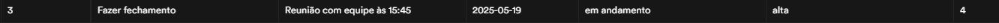
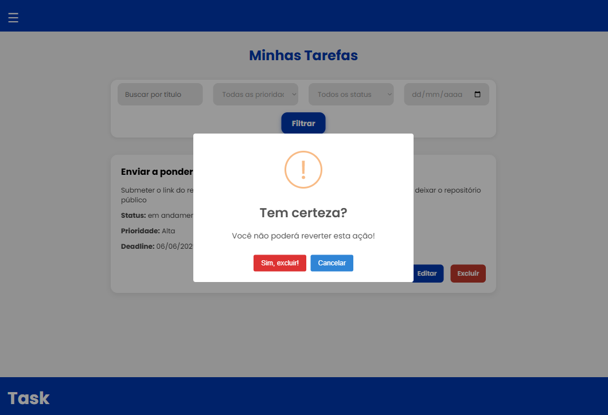

# 1. INTRODUÇÃO
&nbsp; &nbsp; &nbsp; &nbsp;A gestão de tarefas é um processo fundamental para uma maior produtividade, seja em uma empresa ou até mesmo para atividades individuais e do dia a dia (PONTOTEL, 2024). Desse modo, foi criado o vigente projeto de gerenciamento de tarefas, que tem como premissa ser simples e objetivo. Em linhas gerais, ele tem como foco permitir que usuários cadastrados criem, visualizem, editem e excluam tarefas pessoais, organizando-as por prioridade, progresso e prazo (deadline). Em se tratando de aspectos mais técnicos, tal sistema tem sido desenvolvido seguindo o padrão MVC (Model-View-Controller), que facilita a distribuição de funções do software supracitado.

# 2. DIAGRAMAS DO BANCO DE DADOS
&nbsp; &nbsp; &nbsp; &nbsp;De modo geral, a modelagem de dados é o processo de definição e estruturação de como dados serão armazenados (Neves, 2024). Tal procedimento acarreta uma melhor organização do projeto em questão, minimizando erros. Sob essa perspectiva, há, tradicionalmente, há três etapas fundamentais e mais utilizadas para essa modelagem: conceitual, lógica e física. Dessa forma, elas estão descritas, respectivamente, nas seções 2.1, 2.2 e 2.3 (no escopo no vigente projeto de gerenciamento de tarefas).

## 2.1 Modelo conceitual
&nbsp; &nbsp; &nbsp; &nbsp;Essencialmente, o modelo conceitual identifica aspectos fundamentais e basilares de um sistema, mostrando entidades principais e seus respectivos relacionamentos (França, 2023). Dentre as principais ferramentas para a criação do modelo supracitado, menciona-se o Diagrama Entidade-Relacionamento, que demonstra justamente as entidades com suas relações e atributos (características). Portanto, realizou-se esse processo no que se refere ao projeto de gerenciamento de tarefas escopo deste documento (conforme a figura 1).

<p align = "center"> Figura 1 - Diagrama Entidade-Relacionamento </p>


<p align = "center"> Fonte: material produzido pela autora (2025).</p> 
<br>

&nbsp; &nbsp; &nbsp; &nbsp;A partir da figura 1, é possível extrair os seguintes dados, que serão cruciais também para a realização do modelo lógico e do modelo físico:

<h3>ENTIDADE: USUARIO</h3>
<h4>Atributos:</h4>

- id_usuario: identificador do usuário;
- nome_usuario: nome do usuário;
- email: email do usuário;
- senha: senha de acesso do usuário. 

<br>

<h3>ENTIDADE: TAREFA</h3>
<h4>Atributos:</h4>

- id_tarefa: identificador da tarefa;
- título: título ou nome da tarefa;
- descricao: descrição detalhada da tarefa;
- deadline: prazo de conclusão da tarefa;
- progresso: status de progresso da tarefa (ex.: 50%, concluído);
- classificacao: rótulo da tarefa (ex.: UX);
- prioridade: nível de prioridade da tarefa (ex.: alta, média e baixa). 


<br>

<h3>RELACIONAMENTOS</h3>
<h4> USUARIO-TAREFA </h4>

- Cardinalidade: (1,n), que é um-para-muitos;
- Descrição do relacionamento: um usuário pode ter uma ou muitas tarefas.


<h4> TAREFA-USUARIO </h4>

- Cardinalidade: (1,1), que é um-para-um;
- Descrição do relacionamento: uma tarefa se refere a um único usuário.


## 2.2 Modelo lógico/relacional

&nbsp; &nbsp; &nbsp; &nbsp;O modelo lógico consiste na conversão do modelo conceitual em um processo mais próximo do que é, de fato, a implementação de um SGBD (Sistema de Gerenciamento de Banco de Dados). Ademais, seu foco está na definição de tabelas, atributos, tipos de dados, relações, chaves primárias e chaves estrangeiras, aprofundando o que foi feito no conceitual (França, 2023). Dessa forma, foi feito (no software brModelo) o diagrama do modelo lógico no que tange ao vigente projeto, como a figura 2 demonstra. PK indica que um atributo é chave primária e FK indica que um atributo é chave estrangeira. Essa notação foi colocada apenas para facilitar a visualização e no modelo físico elas foram retiradas (ex.: id_usuario (PK) ficou como id_usuario no modelo físico).

<p align = "center"> Figura 2 - Diagrama do modelo lógico</p>


<p align = "center"> Fonte: material produzido pela autora (2025).</p>

<h3>TABELA: USUARIO</h3>
<h4>Atributos (um pouco mais detalhados que no modelo conceitual):</h4>

- id_usuario (PK) - chave primária: identificador único e autoincrementável do usuário;
- nome_usuario: nome do usuário;
- email: email do usuário;
- senha: senha de acesso.

<h3>TABELA: TAREFA</h3>
<h4>Atributos (um pouco mais detalhados que no modelo conceitual):</h4>

- id_tarefa (PK) - chave primária: identificador único e autoincrementável da tarefa;
- titulo: título ou nome da tarefa;
- descricao: descrição detalhada da tarefa;
- deadline: prazo de conclusão da tarefa;
- progresso: status de progresso da tarefa (ex.: 50%, concluído);
- classificacao: rótulo da tarefa (ex.: UX);
- prioridade: nível de prioridade da tarefa (ex.: alta, média e baixa);
- usuario_id (FK): chave estrangeira que referencia USUARIO(id_usuario).


<h3>RELACIONAMENTOS</h3>
&nbsp; &nbsp; &nbsp; &nbsp;Os relacionamentos já foram descritos na seção 2.1. No entanto, achou-se melhor colocá-los aqui novamente para uma melhor leitura.

<h4> USUARIO-TAREFA </h4>

- Cardinalidade: (1,n), que é um-para-muitos;
- Descrição do relacionamento: um usuário pode ter uma ou muitas tarefas.


<h4> TAREFA-USUARIO </h4>

- Cardinalidade: (1,1), que é um-para-um;
- Descrição do relacionamento: uma tarefa se refere a um único usuário.

## 2.3 Modelo físico

&nbsp; &nbsp; &nbsp; &nbsp;Por fim, o modelo físico diz respeito à implementação concreta do banco de dados, com comandos SQL em um SGBD determinado (França, 2023). Desse modo, efetuou-se (usando o Visual Studio Code) o modelo físico referente ao vigente projeto, como é possível ver logo abaixo. Ele será implementado efetivamente nas próximas etapas do projeto individual com o uso do Supabase, plataforma de backend como serviço (BaaS - Backend as a Service) de código aberto baseada em tecnologias PostgreSQL (Oliveira, 2024).	

```sql
CREATE TABLE USUARIO(
  id_usuario SERIAL PRIMARY KEY,
  nome_usuario TEXT NOT NULL,
  email TEXT NOT NULL,
  senha TEXT NOT NULL
);

CREATE TABLE TAREFA (
  id_tarefa SERIAL PRIMARY KEY,
  titulo TEXT NOT NULL,
  descricao TEXT NOT NULL,
  deadline DATE NOT NULL,
  progresso TEXT NOT NULL,
  prioridade TEXT NOT NULL,
  usuario_id INT REFERENCES usuario(id_usuario) ON DELETE CASCADE
);
```

<h3>Descrição um pouco mais aprofundada do modelo físico</h3>

&nbsp; &nbsp; &nbsp; &nbsp;A fim de gerar mais completude ao entendimento do modelo físico, é significativo ressaltar os seguintes aspectos:
- PRIMARY KEY: indica a criação de uma chave primária (identificador);
- NOT NULL: tal especificação impede que um campo seja nulo;
- SERIAL (usado para criação de campos com incremento automático), TEXT (texto), INT (números inteiros) e DATE (data) são os tipos de dados usados nos campos;
- usuario_id INT REFERENCES usuario(id_usuario) ON DELETE CASCADE: tal código define uma chave estrangeira usuario_id, a qual referencia id_usuario (chave primária da tabela USUARIO) e exclui automaticamente os registros relacionados quando o usuário é deletado.

<br>

# 3 ARQUITETURA MVC DO PROJETO
&nbsp; &nbsp; &nbsp; &nbsp; De modo geral a arquitetura MVC é um padrão de construção de software composto por três partes principais (Souza, 2023):
- Model (Modelo): parte que interage com o banco de dados da aplicação, ou seja, é a camada de dados;
- View (Visão): consiste na parte de apresentação visual ao usuário, ou seja, da interface; 
- Controller (Controlador): essa parte atua como uma ponte entre Model e View, sendo responsável por receber as entradas do usuário, processá-las (geralmente com o auxílio do Model) e determinar qual resposta ou visualização (View) deve ser apresentada. Portanto, é ela que coordena o fluxo de dados.

&nbsp; &nbsp; &nbsp; &nbsp;Dessa forma, criou-se a seguinte estrutura MVC para o vigente projeto (conforme a figura 3):
<p align = "center"> Figura 3 - Diagrama MVC</p>
<div align = "center">

</div>
<p align = "center"> Fonte: material produzido pela autora (2025).</p>
<br>

<h3>Explicando o diagrama MVC</h3>
<h4>Cliente</h4>
&nbsp; &nbsp; &nbsp; &nbsp;Em linhas gerais, o segmento de cliente (usuário final) interage com a aplicação por meio de um navegador. A partir disso, as ações feitas pelo usuário são enviadas ao servidor, que processa as requisições e responde com as visualizações adequadas. <br>

<h4>Servidor</h4>
&nbsp; &nbsp; &nbsp; &nbsp;O servidor é a parte da aplicação responsável por receber, processar e responder às solicitações feitas pelos usuários por intermédio do navegador (cliente). Dessa forma, no contexto do vigente projeto, o servidor é composto pelas partes subsequentes: <br> <br>


&nbsp; &nbsp; &nbsp; &nbsp; **Views (Visualizações)** <br>
&nbsp; &nbsp; &nbsp; &nbsp;São as páginas que o usuário vê e interage. **É significativo pontuar que as views só serão implementadas, de fato, na parte 3 deste projeto (mas elas já foram planejadas), conforme as instruções da atividade**. Nesse sentido, cada view corresponde a uma funcionalidade: <br>

&nbsp; &nbsp; &nbsp; &nbsp;- Login: contempla campos de email e senha. Envia os dados para o usuarioController.login;

&nbsp; &nbsp; &nbsp; &nbsp;- Cadastro: possui campos de nome, email e senha. Envia os dados para usuarioController.cadastrarUsuario;

&nbsp; &nbsp; &nbsp; &nbsp; - Header: essa view, que está dentro da pasta components, apresenta botões para acessar funcionalidades da plataforma: botão para renderizar a home, botão para renderizar "Criar tarefa", botão para renderizar "Minhas tarefas", botão para "Logout" e botão para "Apagar conta". Ela usa usuarioController.logout e usuarioController.excluirConta;

&nbsp; &nbsp; &nbsp; &nbsp; - Home: essa view exibe mensagem de boas-vindas, um dashboard (com a quantidade de tarefas a fazer, quantidade de tarefas concluídas e quantidade total de tarefas)

&nbsp; &nbsp; &nbsp; &nbsp; - CriarTarefa: consiste em um formulário com campos título, descrição, deadline, progresso e prioridade. Além disso, envia os dados para tarefaController.salvarTarefa;

&nbsp; &nbsp; &nbsp; &nbsp; - MinhasTarefas: basicamente, nessa view aparecem todas as tarefas do usuário (em forma de cards), com botões para editá-las ou excluí-las. Ao clicar nesses botões, um popup é aberto para tal. Ela se relaciona com tarefaController.listarTarefas, tarefaController.editarTarefa e tarefaController.excluirTarefas  <br> <br>


&nbsp; &nbsp; &nbsp; &nbsp; **Controllers (controladores)** <br>
&nbsp; &nbsp; &nbsp; &nbsp;Como adiantado anteriormente, os controllers recebem as requisições das views e coordenam a interação entre as views e os models. Desse modo, estão listados abaixo os controllers inerentes ao vigente projeto: <br>

&nbsp; &nbsp; &nbsp; &nbsp;**usuarioController**<br>
&nbsp; &nbsp; &nbsp; &nbsp; - cadastrarUsuario: cria um novo usuário;

&nbsp; &nbsp; &nbsp; &nbsp;- login: autentica um usuário existente;

&nbsp; &nbsp; &nbsp; &nbsp; - logout: encerra a sessão do usuário.

&nbsp; &nbsp; &nbsp; &nbsp; - excluirConta: o usuário pode excluir sua conta.
<br> <br>

&nbsp; &nbsp; &nbsp; &nbsp;**tarefaController** <br>
&nbsp; &nbsp; &nbsp; &nbsp; - salvarTarefa: salva uma nova tarefa no banco de dados;

&nbsp; &nbsp; &nbsp; &nbsp; - listarTarefas: retorna todas as tarefas do usuário;

&nbsp; &nbsp; &nbsp; &nbsp; - mostrarTarefa: mostra os detalhes de uma tarefa específica;

&nbsp; &nbsp; &nbsp; &nbsp; - atualizarTarefa: atualiza uma tarefa existente;

&nbsp; &nbsp; &nbsp; &nbsp; - excluirTarefa: remove uma tarefa do sistema.
<br><br>


&nbsp; &nbsp; &nbsp; &nbsp; **Models (modelos)** <br>
&nbsp; &nbsp; &nbsp; &nbsp;Os models representam as estruturas de dados e, consequentemente, interagem diretamente com o banco de dados. Assim, os models do vigente projeto são:

&nbsp; &nbsp; &nbsp; &nbsp;**usuario**

&nbsp; &nbsp; &nbsp; &nbsp;- id_usuario: identificador único;

&nbsp; &nbsp; &nbsp; &nbsp; - nome_usuario: nome do usuário;

&nbsp; &nbsp; &nbsp; &nbsp; - email: email cadastrado;

&nbsp; &nbsp; &nbsp; &nbsp; - senha: senha criptografada. <br> <br>

&nbsp; &nbsp; &nbsp; &nbsp;**tarefa**

&nbsp; &nbsp; &nbsp; &nbsp; - id_tarefa: identificador único;

&nbsp; &nbsp; &nbsp; &nbsp; - titulo: título da tarefa;

&nbsp; &nbsp; &nbsp; &nbsp; - progresso: estado atual da tarefa (ex: “em andamento”, “concluído”);

&nbsp; &nbsp; &nbsp; &nbsp; - prioridade: nível de prioridade da tarefa (baixa, média, alta);

&nbsp; &nbsp; &nbsp; &nbsp; - usuario_id: chave estrangeira referenciando o usuário dono da tarefa.
<br> <br>

&nbsp; &nbsp; &nbsp; &nbsp; **Servidor de banco de dados**
<br>
&nbsp; &nbsp; &nbsp; &nbsp;Em linhas gerais, o banco de dados é PostgreSQL. Ele armazena todos os dados dos usuários e tarefas. Por fim, os models do backend interagem diretamente com este banco para realizar operações de CRUD. <br> <br>

# 4. COMO CONFIGURAR O BANCO DE DADOS E RODAR AS MIGRAÇÕES?
## 4.1 O Supabase
&nbsp; &nbsp; &nbsp; &nbsp; Para o vigente projeto de gerenciamento de tarefas, foi escolhido como banco de dados o Supabase. Ele é um banco de dados PostgreSQL de código aberto gerenciado por um servidor em nuvem (AWS) (Becker, 2023). Assim, para facilitar o entendimento deste projeto, segue um passo a passo de como entrar no Supabase: <br>

&nbsp; &nbsp; &nbsp; &nbsp;1) Pesquise no seu navegador por https://supabase.com/ <br>
&nbsp; &nbsp; &nbsp; &nbsp;2) Clique em sign-in (conforme a figura 4):
<p align = "center"> Figura 4 - Home do Supabase</p>


<p align = "center"> Fonte: material retirado do Supabase.</p>
<br><br>

&nbsp; &nbsp; &nbsp; &nbsp;3) Insira seus dados para cadastro (conforme a figura 5):
<p align = "center"> Figura 5 - Home do Supabase</p>


<p align = "center"> Fonte: material retirado do Supabase.</p>
<br><br>


&nbsp; &nbsp; &nbsp; &nbsp;4) Crie uma organização no Supabase (conforme a figura 6):
<p align = "center"> Figura 6 - Organização no Supabase</p>


<p align = "center"> Fonte: material retirado do Supabase.</p>
<br><br>


&nbsp; &nbsp; &nbsp; &nbsp;5) Crie uma organização no Supabase (conforme a figura 7):
<p align = "center"> Figura 7 - Criando organização no Supabase</p>


<p align = "center"> Fonte: material retirado do Supabase.</p>
<br><br>

&nbsp; &nbsp; &nbsp; &nbsp;6) Crie um projeto no Supabase (conforme a figura 8). **OBSERVAÇÃO: a seta amarela está apontando para o campo de senha do banco de dados. Defina uma e SALVE ELA, uma vez que ela será importante para a conexão com o banco de dados posteriormente (especificamente na variável ambiente DB_PASSWORD no arquivo .env)**:
<p align = "center"> Figura 8 - Criando projeto no Supabase </p>


<p align = "center"> Fonte: material retirado do Supabase.</p>
<br><br>

&nbsp; &nbsp; &nbsp; &nbsp;7) Depois disso, a interface do Supabase será aberta (conforme a figura 9).

<p align = "center"> Figura 9 - Interface do Supabase</p>


<p align = "center"> Fonte: material retirado do Supabase.</p>

<br><br>

&nbsp; &nbsp; &nbsp; &nbsp; Agora, na seção 4.2, será mostrado como configurar esse banco de dados no Supabase.

## 4.2 Configurando o banco de dados e as migrações
&nbsp; &nbsp; &nbsp; &nbsp; Para configurar o banco de dados, é necessário seguir os seguintes passos:

 &nbsp; &nbsp; &nbsp; &nbsp; **PASSO 1**: renomeie o arquivo .env.example para .env e configure das variáveis de ambiente necessárias nele. Dessa forma, as variáveis de ambiente usadas nesse arquivo são:

```
DB_USER=
DB_HOST=
DB_DATABASE=
DB_PASSWORD=
DB_PORT=
DB_SSL=
PORT=
```
<br>

&nbsp; &nbsp; &nbsp; &nbsp;**Na seção PORT, a porta usada neste projeto é a 3000**. Os outros dados para colocar nas variáveis de ambiente podem ser conferidas dentro do próprio site do Supabase da seguinte forma: <br>
&nbsp; &nbsp; &nbsp; &nbsp; **Procure pelo botão "Connect" ao entrar no Supabase (conforme a figura 10):** 

<p align = "center"> Figura 10 - Botão Connect do Supabase</p>

<p align = "center"> Fonte: material retirado do Supabase.</p>
<br> <br>

&nbsp; &nbsp; &nbsp; &nbsp;**PASSO 2: após ter clicado em Connect, role a seção para baixo e procure por "Session pooler" e clique em "View parameters" (conforme a figura 11). Nessa seção, estão todos os dados necessários para colocar no .env e, assim, conectar o banco de dados ao projeto:**

<p align = "center"> Figura 11 - Session Pooler no Supabase</p>
<div align = "center">

</div>
<p align = "center"> Fonte: material retirado do Supabase.</p>
<br>


&nbsp; &nbsp; &nbsp; &nbsp;**PASSO 3: após ter clicado em View parameters (conforme a figura 12), aparecerão os seguintes dados (eu deixei os da imagem cobertos por questões de segurança):**
<p align = "center"> Figura 12 - Dados para conexão com o banco de dados</p>
<div align = "center">

</div>
<p align = "center"> Fonte: material retirado do Supabase.</p>
<br>

&nbsp; &nbsp; &nbsp; &nbsp; Faça o seguinte:
- Insira o dado de host na variável de ambiente DB_HOST do arquivo .env;
- Insira o dado de port na variável de ambiente DB_PORT do arquivo .env;
- Insira o dado de database na variável de ambiente DB_DATABASE do arquivo .env;
- Insira o dado de user na variável de ambiente DB_USER do arquivo .env;
- Insira 3000 na variável de ambiente PORT do arquivo .env;
- Insira true na variável de ambiente DB_SSL do arquivo .env;
- Insira a senha definida na criação do projeto na variável de ambiente DB_PASSWORD do arquivo .env (por isso que foi sugerido salvá-la, uma vez que será utilizada aqui, vide figura 8).
 <br> <br>

&nbsp; &nbsp; &nbsp; &nbsp; **PASSO 4 - MIGRAÇÕES**: após seguir os passos anteriores, execute o script de inicialização abaixo pelo terminal. É significativo pontuar que esse processo é responsável por preparar o banco de dados com a estrutura necessária para o funcionamento da aplicação. No que tange a isso, o arquivo init.sql (que está dentro da pasta scripts) contém os comandos SQL responsáveis por criar o banco de dados e suas tabelas iniciais. Nesse sentido, ele define a estrutura do banco — como os nomes das tabelas, colunas, tipos de dados, chaves primárias, relacionamentos, entre outros. Dessa forma, para rodar essa migração inicial e criar o banco no Supabase, utilize o seguinte comando:
```
npm run init-db
```
<br> <br>

&nbsp; &nbsp; &nbsp; &nbsp;**PASSO 5: por fim, execute o seguinte comando no terminal para rodar o servidor:**
```
node server.js
```
<br> <br>

# 5. COMO TESTAR AS APIs?
&nbsp; &nbsp; &nbsp; &nbsp;Para testar as APIs do vigente projeto, recomenda-se o uso do software Postman.

## 5.1 O Postman
&nbsp; &nbsp; &nbsp; &nbsp;De modo geral, o Postman é uma ferramenta que auxilia no teste de APIs. Para instalá-lo, faça o seguinte:<br>

&nbsp; &nbsp; &nbsp; &nbsp; **INSTALAR O POSTMAN: pesquise no seu navegador por https://www.postman.com/downloads/ e instale o Postman, colocando suas respectivas configurações (conforme a figura 13)**:

<p align = "center"> Figura 13 - Instalando o Postman</p>
<div align = "center">

</div>
<p align = "center"> Fonte: material retirado do site do Postman.</p>
<br>

## 5.2 Testando as APIs

&nbsp; &nbsp; &nbsp; &nbsp; Para testar as APIs no Postman, siga os seguintes passos:

&nbsp; &nbsp; &nbsp; &nbsp; **1)Abra o Postman no seu computador** <br>

&nbsp; &nbsp; &nbsp; &nbsp; **2)Ao abrir o Postman, clique em "New" no canto superior esquerdo (conforme a figura 14)**:
<p align = "center"> Figura 14 - Clicando em "New" no Postman</p>
<div align = "center">

</div>
<p align = "center"> Fonte: material retirado do aplicativo do Postman.</p>
<br>

&nbsp; &nbsp; &nbsp; &nbsp; **3)Clique em HTTP (conforme a figura 15)**:
<p align = "center"> Figura 15 - Clicando em "HTTP" no Postman</p>
<div align = "center">

</div>
<p align = "center"> Fonte: material retirado do aplicativo do Postman.</p>
<br>

&nbsp; &nbsp; &nbsp; &nbsp; **4)Após isso, será aberta a interface para a realização de requisições no Postman (conforme a figura 16)**:
<p align = "center"> Figura 16 - Interface para requisições no Postman</p>
<div align = "center">

</div>
<p align = "center"> Fonte: material retirado do aplicativo do Postman.</p>
<br>

&nbsp; &nbsp; &nbsp; &nbsp; **5)Depois, na aba Body, selecione raw e JSON para realizar as requisições(conforme a figura 17);**:
<p align = "center"> Figura 17 - Interface para requisições no Postman</p>
<div align = "center">

</div>
<p align = "center"> Fonte: material retirado do aplicativo do Postman.</p>
<br>

&nbsp; &nbsp; &nbsp; &nbsp;**OBS.: depois de realizar todos os passos anteriores, faça os passos seguintes:**

<h3> REQUISIÇÃO DE CADASTRO DE USUÁRIO</h3>

&nbsp; &nbsp; &nbsp; &nbsp; Método de requisição: POST (mandar dados para o servidor); <br>
&nbsp; &nbsp; &nbsp; &nbsp; URL: http://localhost:3000/cadastro <br> <br>
&nbsp; &nbsp; &nbsp; &nbsp;**Como testar a requisição de cadastro?** <br>
&nbsp; &nbsp; &nbsp; &nbsp;**Passo 1:** selecione o método POST no drop-down acima de "Params"<br>
&nbsp; &nbsp; &nbsp; &nbsp;**Passo 2:** insira a URL no campo em que está escrito "Enter URL or paste text" <br>
&nbsp; &nbsp; &nbsp; &nbsp;**Passo 3:** insira um código como o apresentado abaixo nas linhas de comando que estão logo abaixo da seção de URL (pode substituir os valores de nome_usuario, email e senha pelos de sua preferência). A exemplificação de uma requisição de cadastro está demonstrada na figura 18:<br>

```
{
  "nome_usuario": "insira seu nome aqui",
  "email": "insira seu email aqui",
  "senha": "insira sua senha aqui"
}
```
<br> <br>

<p align = "center"> Figura 18 - Exemplo de requisição de cadastro</p>
<div align = "center">

</div>
<p align = "center"> Fonte: material retirado do aplicativo do Postman.</p>
<br>

&nbsp; &nbsp; &nbsp; &nbsp;**Passo 4:** clique no botão Send. A resposta esperada é a demonstração dos dados cadastrados (figura 19). Depois disso, os dados são armazenados no Supabase (figura 20).<br>

<p align = "center"> Figura 19 - Exemplo de resposta de cadastro</p>
<div align = "center">

</div>
<p align = "center"> Fonte: material retirado do aplicativo do Postman.</p>
<br>


<p align = "center"> Figura 20 - Usuário cadastrado no banco de dados</p>
<div align = "center">

</div>
<p align = "center"> Fonte: material retirado do site do Supabase.</p>
<br>

<h3> REQUISIÇÃO DE LOGIN DE USUÁRIO</h3>
&nbsp; &nbsp; &nbsp; &nbsp; Método de requisição: POST (mandar dados para o servidor); <br>
&nbsp; &nbsp; &nbsp; &nbsp; URL: http://localhost:3000/login <br> <br>

&nbsp; &nbsp; &nbsp; &nbsp; **Como testar a requisição de login?**<br>

&nbsp; &nbsp; &nbsp; &nbsp;Após ter feito o cadastro, realize o login seguindo os passos subsequentes:<br>
&nbsp; &nbsp; &nbsp; &nbsp;**Passo 1:** selecione o método POST no drop-down acima de "Params"<br>
&nbsp; &nbsp; &nbsp; &nbsp;**Passo 2:** insira a URL no campo em que está escrito "Enter URL or paste text" <br>
&nbsp; &nbsp; &nbsp; &nbsp;**Passo 3:** insira o seu usuário cadastrado (com email e senha) nas linhas de comando que estão logo abaixo da seção de URL **usando o formato apresentado abaixo** . A exemplificação de uma requisição de login está demonstrada na figura 21.<br>

```
{
  "email": "insira seu email cadastrado aqui",
  "senha": "insira sua senha cadastrada aqui"
}
```
<br>
<br>
<p align = "center"> Figura 21 - Exemplo de requisição de login</p>
<div align = "center">

</div>
<p align = "center"> Fonte: material retirado do aplicativo do Postman.</p>
<br>

&nbsp; &nbsp; &nbsp; &nbsp;**Passo 4:** clique no botão Send. A resposta esperada é uma mensagem de login realizado com sucesso juntamente com o dados do usuário logado (figura 22).<br>

<p align = "center"> Figura 22 - Exemplo de resposta de login</p>
<div align = "center">

</div>
<p align = "center"> Fonte: material retirado do aplicativo do Postman.</p>
<br>


<h3> REQUISIÇÃO DE CRIAR TAREFAS</h3>
&nbsp; &nbsp; &nbsp; &nbsp; Método de requisição: POST (mandar dados para o servidor); <br>
&nbsp; &nbsp; &nbsp; &nbsp; URL: http://localhost:3000/tarefas <br> <br>

&nbsp; &nbsp; &nbsp; &nbsp; **Como testar a requisição de criar tarefas?**<br>

&nbsp; &nbsp; &nbsp; &nbsp;Após ter feito o login (**SE E SOMENTE SE VOCÊ TIVER FEITO O LOGIN**), crie tarefas seguindo os passos subsequentes:<br>
&nbsp; &nbsp; &nbsp; &nbsp;**Passo 1:** selecione o método POST no drop-down acima de "Params"<br>
&nbsp; &nbsp; &nbsp; &nbsp;**Passo 2:** insira a URL no campo em que está escrito "Enter URL or paste text" <br>
&nbsp; &nbsp; &nbsp; &nbsp;**Passo 3:** insira os dados das tarefas nas linhas de comando que estão logo abaixo da seção de URL **usando o formato apresentado abaixo** . A exemplificação de uma requisição de criação de tarefas está demonstrada na figura 23.<br>

```
{
  "titulo": "Coloque o título da sua tarefa aqui",
  "descricao": "Coloque a descrição da sua tarefa aqui",
  "deadline": "Coloque o prazo da sua tarefa usando este formato: 2025-05-25",
  "progresso": "Coloque aqui se a sua tarefa está pendente, em andamento ou feita",
  "prioridade": "Coloque aqui a prioridade da sua tarefa (alta, média ou baixa)"
}

```
<br> <br>

<p align = "center"> Figura 23 - Exemplo de requisição de criar tarefa</p>
<div align = "center">

</div>
<p align = "center"> Fonte: material retirado do aplicativo do Postman.</p>
<br>

&nbsp; &nbsp; &nbsp; &nbsp;**Passo 4:** clique no botão Send. A resposta esperada é o retorno dos dados da tarefa que foi cadastrada (figura 24). Além disso, a figura 25 mostra a tarefa cadastrada no Supabase.<br>
<p align = "center"> Figura 24 - Exemplo de resposta de criar tarefa</p>
<div align = "center">

</div>
<p align = "center"> Fonte: material retirado do aplicativo do Postman.</p>
<br>

<p align = "center"> Figura 25 - Tarefa cadastrada no banco de dados</p>
<div align = "center">

</div>
<p align = "center"> Fonte: material retirado do site do Supabase.</p>
<br>


<h3> REQUISIÇÃO DE ATUALIZAR TAREFAS</h3>
&nbsp; &nbsp; &nbsp; &nbsp; Método de requisição: PUT (substituir dados no servidor); <br>
&nbsp; &nbsp; &nbsp; &nbsp; URL: http://localhost:3000/tarefas/1 (pode substituir esse número pelo id da tarefa) <br> <br>

&nbsp; &nbsp; &nbsp; &nbsp; **Como testar a requisição de atualizar tarefas?**<br>

&nbsp; &nbsp; &nbsp; &nbsp;Após ter cadastrado ao menos uma tarefa, atualize tarefas seguindo os passos subsequentes:<br>
&nbsp; &nbsp; &nbsp; &nbsp;**Passo 1:** selecione o método PUT no drop-down acima de "Params"<br>
&nbsp; &nbsp; &nbsp; &nbsp;**Passo 2:** insira a URL no campo em que está escrito "Enter URL or paste text", substituindo o número na URL pelo id da tarefa cadastrada (conforme retornado na resposta de login no campo id_tarefa). <br>
&nbsp; &nbsp; &nbsp; &nbsp;**Passo 3:** insira os dados atualizados da tarefa nas linhas de comando que estão logo abaixo da seção de URL **usando o formato apresentado abaixo** . A exemplificação de uma requisição de atualização de tarefas está demonstrada na figura 26.<br>

```
{
  "titulo": "Coloque o título da sua tarefa aqui",
  "descricao": "Coloque a descrição da sua tarefa aqui",
  "deadline": "Coloque o prazo da sua tarefa usando este formato: 2025-05-25",
  "progresso": "Coloque aqui se a sua tarefa está pendente, em andamento ou feita",
  "prioridade": "Coloque aqui a prioridade da sua tarefa (alta, média ou baixa)"
}

```
<br> <br>

<p align = "center"> Figura 26 - Exemplo de requisição de atualizar tarefa</p>
<div align = "center">

</div>
<p align = "center"> Fonte: material retirado do aplicativo do Postman.</p>
<br>

&nbsp; &nbsp; &nbsp; &nbsp;**Passo 4:** clique no botão Send. A resposta esperada é a mensagem "Tarefa atualizada com sucesso" (figura 27). Além disso, a figura 28 mostra a tarefa atualizada no Supabase.<br>

<p align = "center"> Figura 27 - Exemplo de resposta de atualizar tarefa</p>
<div align = "center">

</div>
<p align = "center"> Fonte: material retirado do aplicativo do Postman.</p>
<br>

<p align = "center"> Figura 28 - Tarefa atualizada no banco de dados</p>
<div align = "center">

</div>
<p align = "center"> Fonte: material retirado do site do Supabase.</p>
<br>

<h3> REQUISIÇÃO DE LISTAR TAREFAS (DO USUÁRIO LOGADO)</h3>
&nbsp; &nbsp; &nbsp; &nbsp; Método de requisição: GET (pegar dados do servidor); <br>
&nbsp; &nbsp; &nbsp; &nbsp; URL: http://localhost:3000/tarefas <br> <br>

&nbsp; &nbsp; &nbsp; &nbsp; **Como testar a requisição de listar tarefas DO USUÁRIO QUE ESTÁ LOGADO?**<br>

&nbsp; &nbsp; &nbsp; &nbsp;Após ter cadastrado ao menos uma tarefa, liste tarefas seguindo os passos subsequentes:<br>
&nbsp; &nbsp; &nbsp; &nbsp;**Passo 1:** selecione o método GET no drop-down acima de "Params"<br>
&nbsp; &nbsp; &nbsp; &nbsp;**Passo 2:** insira a URL no campo em que está escrito "Enter URL or paste text". <br>
&nbsp; &nbsp; &nbsp; &nbsp;**Passo 3:** No caso desta requisição, não é necessário inserir nenhum código em formato JSON nas linhas de comando, apenas clique em Send. Nesse sentido, a  exemplificação de uma requisição de listagem de tarefas está demonstrada na figura 29.<br>

<p align = "center"> Figura 29 - Exemplo de requisição de listar tarefas</p>
<div align = "center">

</div>
<p align = "center"> Fonte: material retirado do aplicativo do Postman.</p>
<br>

&nbsp; &nbsp; &nbsp; &nbsp;**Passo 4:** clique no botão Send. A resposta esperada é a listagem das tarefas do USUÁRIO LOGADO (figura 30).<br>

<p align = "center"> Figura 30 - Exemplo de resposta de listar tarefas</p>
<div align = "center">

</div>
<p align = "center"> Fonte: material retirado do aplicativo do Postman.</p>
<br>


<h3> REQUISIÇÃO DE LOGOUT DE USUÁRIO</h3>
&nbsp; &nbsp; &nbsp; &nbsp; Método de requisição: GET; <br>
&nbsp; &nbsp; &nbsp; &nbsp; URL: http://localhost:3000/logout <br> <br>

&nbsp; &nbsp; &nbsp; &nbsp; **Como testar a requisição de logout?**<br>

&nbsp; &nbsp; &nbsp; &nbsp;Faça logout seguindo os passos subsequentes:<br>
&nbsp; &nbsp; &nbsp; &nbsp;**Passo 1:** selecione o método GET no drop-down acima de "Params"<br>
&nbsp; &nbsp; &nbsp; &nbsp;**Passo 2:** insira a URL no campo em que está escrito "Enter URL or paste text". <br>
&nbsp; &nbsp; &nbsp; &nbsp;**Passo 3:** No caso desta requisição, não é necessário inserir nenhum código em formato JSON nas linhas de comando, apenas clique em Send. Nesse sentido, a  exemplificação de uma requisição de logout está demonstrada na figura 31.<br>

<p align = "center"> Figura 31 - Exemplo de requisição de logout</p>
<div align = "center">

</div>
<p align = "center"> Fonte: material retirado do aplicativo do Postman.</p>
<br>

&nbsp; &nbsp; &nbsp; &nbsp;**Passo 4:** clique no botão Send. A resposta esperada é a mensagem "Logout realizado com sucesso" (figura 32).<br>

<p align = "center"> Figura 32 - Exemplo de resposta de logout</p>
<div align = "center">

</div>
<p align = "center"> Fonte: material retirado do aplicativo do Postman.</p>
<br>


# 6. PARTE 3 DO PROJETO: PARTE VISUAL, VIEWS E CSS
&nbsp; &nbsp; &nbsp; &nbsp;Na terceira parte deste projeto, o foco foi desenvolver a parte visual da aplicação, ou seja, as views, juntamente com sua estilização, a qual foi aplicada com o CSS, largamente usado em desenvolvimento de páginas web para aplicar estilos. Além disso, buscou-se aplicar responsividade ao site e algumas animações (scripts/animacoes.js, que usa a biblioteca ScrollReveal).

&nbsp; &nbsp; &nbsp; &nbsp;Com base nisso, foram desenvolvidas 6 views: Landing page, login, cadastro, home, minhas tarefas e criar tarefa. Ademais, o footer e o header da aplicação foram separados na pasta components, uma vez que estão padronizados para as views.

&nbsp; &nbsp; &nbsp; &nbsp;A figura 33 mostra a view de landing page, que possui os botões de login, cadastro e inscreva-se grátis (que direciona para o cadastro também).
<p align = "center"> Figura 33 - View de Landing Page</p>
<div align = "center">

</div>
<p align = "center"> Fonte: material produzido pela autora (2025).</p>
<br>

&nbsp; &nbsp; &nbsp; &nbsp;A figura 34 mostra a view de cadastro quando o usuário a acessa. A figura 35 mostra a verificação se o e-mail possui @ em sua estrutura (com base na estrutura padrão de e-mail, já que o input é do tipo e-mail). A figura 36 mostra o popup que aparece quando o usuário tenta cadastrar uma senha sem 8 caracteres, 1 letra maiúscula e um caractere especial. ,A figura 37 mostra o popup que aparece ao usuário quando ele tenta cadastrar um e-mail que já está cadastrado. Vale mencionar que quando o usuário faz o cadastro com sucesso, ele é direcionado à view de login para entrar no site. 
<p align = "center"> Figura 34 - View de cadastro</p>
<div align = "center">

</div>
<p align = "center"> Fonte: material produzido pela autora (2025).</p>
<br>

<p align = "center"> Figura 35 - View de cadastro - testar email sem @</p>
<div align = "center">

</div>
<p align = "center"> Fonte: material produzido pela autora (2025).</p>
<br>

<p align = "center"> Figura 36 - View de cadastro - testar senha sem 8 caracteres, 1 letra maiúscula e um caractere especial </p>
<div align = "center">

</div>
<p align = "center"> Fonte: material produzido pela autora (2025).</p>
<br>

<p align = "center"> Figura 37 - View de cadastro - testar cadastro com um email já cadastrado </p>
<div align = "center">

</div>
<p align = "center"> Fonte: material produzido pela autora (2025).</p>
<br> <br>

&nbsp; &nbsp; &nbsp; &nbsp;A figura 38 mostra a view de login quando o usuário a acessa. Já a figura 39 mostra o popup que é apresentado ao usuário quando ele erra seu e-mail ou sua senha. Já a figura 40 mostra o popup que aparece ao usuário quando ele faz o login com sucesso. Logo abaixo das imagens, é mostrado  como fetch API foi usado na tela de login.

<p align = "center"> Figura 38 - View de login</p>
<div align = "center">

</div>
<p align = "center"> Fonte: material produzido pela autora (2025).</p>
<br>


<p align = "center"> Figura 39 - View de login - e-mail ou senha incorretos</p>
<div align = "center">

</div>
<p align = "center"> Fonte: material produzido pela autora (2025).</p>
<br>

<p align = "center"> Figura 40 - View de login - sucesso no login</p>
<div align = "center">

</div>
<p align = "center"> Fonte: material produzido pela autora (2025).</p>
<br>

```javascript
// ***USO DE FETCH API NO LOGIN -> arquivo scripts/login.js***
try {
      //Feth API
      const response = await fetch('/login', {
            method: 'POST',
            headers: { 'Content-Type': 'application/json' },
            body: JSON.stringify({ email, senha })
        });

      const data = await response.json();

      if (response.ok) {
            // Login OK
            Swal.fire({
                icon: 'success',
                title: 'Sucesso!',
                text: data.mensagem,
                timer: 2000,
                showConfirmButton: false,
                scrollbarPadding: false
            }).then(() => {
                //Redirecionar para home depois do alerta fechar.
                window.location.href = '/home';
            });

        }else {
            //Erro no login (ex: senha incorreta).
            Swal.fire({
                icon: 'error',
                title: 'Erro',
                text: data.error || 'Erro ao realizar login'
            });
        }
}catch (error) {
            Swal.fire({
            icon: 'error',
            title: 'Erro',
            text: 'Erro na comunicação com o servidor'
        });
            console.error(error);
}
```
 <br> <br>

&nbsp; &nbsp; &nbsp; &nbsp;As figuras 41 e 42 mostra a tela de home, que é aberta após o login do usuário. Nela, são mostradas quantas tarefas o usuário têm no total, quantas estão concluídas e quantas estão pendentes, por meio de um m. Além disso, especificamente a figura 42 apresenta a seção de gráficos que é apresentada ao usuário.
<p align = "center"> Figura 41 - View de home - parte 1</p>
<div align = "center">

</div>
<p align = "center"> Fonte: material produzido pela autora (2025).</p>
<br>

<p align = "center"> Figura 42 - View de home - parte 2</p>
<div align = "center">

</div>
<p align = "center"> Fonte: material produzido pela autora (2025).</p>
<br>

```javascript
    //Este código, que está em controllers/usuarioController.js, manda os dados para a view de home com uma identificação específica.
    res.render('Home/index', {
      nomeUsuario: usuario.nome_usuario,
      totalTarefas: total,
      tarefasConcluidas: concluidas,
      tarefasAFazer: aFazer
    });
```
<br> 

```
//E essa identificação é aplicada em views/Home/index.ejs dessa maneira:
<h2 class="home__body__dashboard__cartao__numero"><%= tarefasConcluidas %></h2>
<h2 class="home__body__dashboard__cartao__numero"><%= totalTarefas %></h2> 
<h2 class="home__body__dashboard__cartao__numero"><%= totalTarefas %></h2>               
```
<br> <br>
&nbsp; &nbsp; &nbsp; &nbsp;A figura 43 mostra a sidebar que é aberta quando o usuário clica no menu hambúrguer no canto superior esquerdo da tela, com todas as opções de funcionalidades da aplicação web (ir para home, minhas tarefas, criar tarefa, logout e excluir conta). Essa sidebar é padrão para todas as páginas do site. Por fim, o uso de fetch API nessa parte está explicitado logo abaixo das figuras.
<p align = "center"> Figura 43 - Abrindo a sidebar</p>
<div align = "center">

</div>
<p align = "center"> Fonte: material produzido pela autora (2025).</p>
<br>

```javascript
//***USANDO FETCH API NA SIDEBAR***
//1) Fetch API para logout --> ARQUIVO scripts/logout.js
document.getElementById('btn-logout').addEventListener('click', function(event) {
  event.preventDefault();

  Swal.fire({
    title: 'Tem certeza que deseja sair?',
    icon: 'warning',
    showCancelButton: true,
    confirmButtonColor: '#d33',
    cancelButtonColor: '#3085d6',
    confirmButtonText: 'Sim, sair',
    cancelButtonText: 'Cancelar'
  }).then(async (result) => {
    if (result.isConfirmed) {
      try {
        //Fazendo o logout via GET.
        const response = await fetch('/logout', { method: 'GET' });
        
        if (response.ok) {
          //Mostrando a mensagem de sucesso do logout.
          Swal.fire({
            icon: 'success',
            title: 'Logout efetuado com sucesso!',
            showConfirmButton: false,
            timer: 1500,
          }).then(() => {
            //Redirecionando para a landing page após o logout.
            window.location.href = '/';
          });
        } else {
          Swal.fire('Erro', 'Não foi possível sair. Tente novamente.', 'error');
        }
      } catch (error) {
        Swal.fire('Erro', 'Erro ao se comunicar com o servidor.', 'error');
      }
    }
  });
});
```

```javascript
//2)Fetch API para exclusão de conta do usuário --> ARQUIVO scripts/excluirConta.js
document.getElementById("btn-excluir-conta").addEventListener("click", async () => {
  const { isConfirmed } = await Swal.fire({
    title: 'Tem certeza?',
    text: "Deseja apagar sua conta? Essa ação não pode ser desfeita.",
    icon: 'warning',
    showCancelButton: true,
    confirmButtonColor: '#d33',
    cancelButtonColor: '#3085d6',
    confirmButtonText: 'Sim, apagar minha conta',
    cancelButtonText: 'Cancelar'
  });

  if (!isConfirmed) return;

  //Usando fetch API para excluir conta.
  try {
    const res = await fetch("/excluirConta", {
      method: "DELETE",
      headers: { "Content-Type": "application/json" }
    });

    const data = await res.json();

    if (res.ok) {
      await Swal.fire({
        icon: 'success',
        title: 'Conta apagada',
        text: data.mensagem,
        timer: 2500,
        timerProgressBar: true,
        showConfirmButton: false,
      });
      window.location.href = "/"; 
    } else {
      Swal.fire({
        icon: 'error',
        title: 'Erro',
        text: data.error || 'Erro ao apagar conta.',
      });
    }
  } catch (error) {
    Swal.fire({
      icon: 'error',
      title: 'Erro',
      text: 'Erro na comunicação com o servidor.',
    });
  }
});
```
<br><br>

&nbsp; &nbsp; &nbsp; &nbsp;As figuras 44, 45 e 46 mostram a view de criar tarefas. A figura 45 mostra o popup que aparece quando o usuário tenta criar uma tarefa vazia (aparece um erro). Já a figura 46 mostra o popup que é apresentado ao usuário quando ele cria uma tarefa com sucesso. Por fim, o uso de fetch API nessa parte está explicitado logo abaixo das figuras.

<p align = "center"> Figura 44 - View de criar tarefa</p>
<div align = "center">

</div>
<p align = "center"> Fonte: material produzido pela autora (2025).</p>
<br>

<p align = "center"> Figura 45 - View de criar tarefa - testando enviar tarefa vazia</p>
<div align = "center">

</div>
<p align = "center"> Fonte: material produzido pela autora (2025).</p>
<br>

<p align = "center"> Figura 46 - View de criar tarefa - criando tarefa com sucesso</p>
<div align = "center">

</div>
<p align = "center"> Fonte: material produzido pela autora (2025).</p>
<br> <br>

```javascript
//***Trecho do ARQUIVO scripts/criarConta.js***

//Usando fetch API para mandar os dados das tarefas criadas ao banco por meio da rota /tarefas.
    try {
      const resposta = await fetch('/tarefas', {
        method: 'POST',
        headers: { 'Content-Type': 'application/json' },
        body: JSON.stringify(dados)
      });

      //Retornando ao usuário se a tarefa foi criada com sucesso ou não.
      if (resposta.ok) {
        Swal.fire({
          icon: 'success',
          title: 'Tarefa criada!',
          text: 'Sua tarefa foi registrada com sucesso.',
          confirmButtonColor: '#0038B0'
        });
        e.target.reset();
      } else {
        const erro = await resposta.text();
        Swal.fire({
          icon: 'error',
          title: 'Erro ao criar tarefa',
          text: erro,
          confirmButtonColor: '#c0392b'
        });
      }
    } catch (err) {
      Swal.fire({
        icon: 'error',
        title: 'Erro no servidor',
        text: 'Tente novamente mais tarde.',
        confirmButtonColor: '#c0392b'
      });
    }
```

<br><br>


&nbsp; &nbsp; &nbsp; &nbsp;Das figuras 47 a 51 é mostrada a view de minhas tarefas. Na parte superior da página, há uma área de filtros que permite ao usuário buscar tarefas com base em critérios como título, prioridade, status e data. Abaixo dessa parte de filtros ficam os cards, que resumem uma tarefa específica, contendo informações como título, descrição, status, prioridade e prazo. Além disso, esses cartões também oferecem botões de ação para editar ou excluir a tarefa. Especificamente, a figura 48 mostra o processo de edição de tarefas (por meio de um popup) e a figura 50 apresenta um popup que pergunta ao usuário se ele, de fato, quer excluir uma tarefa. Já as figuras 49 e 51 mostram os popups que são mostrados quando uma tarefa é editada com sucesso e quando uma tarefa é excluída com sucesso, respectivamente. Logo abaixo das figuras, está explicitado como fetch API foi usado.

<p align = "center"> Figura 47 - View de minhas tarefas</p>
<div align = "center">

</div>
<p align = "center"> Fonte: material produzido pela autora (2025).</p>
<br>


<p align = "center"> Figura 48 - View de minhas tarefas - Abrindo o popup para editar tarefas</p>
<div align = "center">

</div>
<p align = "center"> Fonte: material produzido pela autora (2025).</p>
<br>

<p align = "center"> Figura 49 - View de minhas tarefas - Atualizando tarefa com sucesso</p>
<div align = "center">

</div>
<p align = "center"> Fonte: material produzido pela autora (2025).</p>
<br>

<p align = "center"> Figura 50 - View de minhas tarefas - Popup de confirmação para excluir tarefas</p>
<div align = "center">

</div>
<p align = "center"> Fonte: material produzido pela autora (2025).</p>
<br>

<p align = "center"> Figura 51 - View de minhas tarefas - tarefa excluída com sucesso</p>
<div align = "center">

</div>
<p align = "center"> Fonte: material produzido pela autora (2025).</p>
<br> <br>


```javascript
//*** ARQUIVO scripts/listarTarefas.js***

//Função para criar o card da tarefa dinamicamente.
function criarCardTarefa(tarefa) {
  const statusFormatado = tarefa.progresso.charAt(0).toLowerCase() + tarefa.progresso.slice(1);
  return `
    <div class="card-tarefa" data-id="${tarefa.id_tarefa}">
      <h2>${tarefa.titulo}</h2>
      <p>${tarefa.descricao}</p>
      <p><strong>Status:</strong> ${statusFormatado}</p>
      <p><strong>Prioridade:</strong> ${tarefa.prioridade}</p>
      <p><strong>Deadline:</strong> ${tarefa.data_formatada || tarefa.deadline}</p>
      <div class="acoes">
        <button class="btn-editar" data-id="${tarefa.id_tarefa}">Editar</button>
        <button class="btn-excluir" data-id="${tarefa.id_tarefa}">Excluir</button>
      </div>
    </div>
  `;
}

//Função para aplicar eventos às tarefas.
function aplicarEventos(tarefas) {
  const lista = document.getElementById('listaTarefas');
  if (!tarefas.length) {
    lista.innerHTML = '<p>Nenhuma tarefa encontrada.</p>';
    return;
  }

  lista.innerHTML = tarefas.map(criarCardTarefa).join('');

  //Botão excuir tarefas.
  document.querySelectorAll('.btn-excluir').forEach(btn => {
    btn.addEventListener('click', async () => {
      const id = btn.getAttribute('data-id');
      Swal.fire({
        title: 'Tem certeza?',
        text: 'Você não poderá reverter esta ação!',
        icon: 'warning',
        showCancelButton: true,
        confirmButtonColor: '#d33',
        cancelButtonColor: '#3085d6',
        confirmButtonText: 'Sim, excluir!',
        cancelButtonText: 'Cancelar'
      }).then(async (result) => {
        if (result.isConfirmed) {
          //Usando fetch API para excluir tarefas.
          try {
            const res = await fetch(`/tarefas/${id}`, { method: 'DELETE' });
            const json = await res.json();

            if (res.ok) {
              btn.closest('.card-tarefa').remove();
              Swal.fire('Excluído!', json.mensagem || 'A tarefa foi removida.', 'success');
            } else {
              Swal.fire('Erro!', json.erro || 'Erro ao excluir tarefa.', 'error');
            }
          } catch (err) {
            console.error(err);
            Swal.fire('Erro!', 'Erro ao excluir tarefa.', 'error');
          }
        }
      });
    });
  });


  //Botão editar tarefas.
  document.querySelectorAll('.btn-editar').forEach(btn => {
    btn.addEventListener('click', async () => {
      const id = btn.getAttribute('data-id');
      try {
        const res = await fetch(`/tarefas/${id}`);
        const tarefa = await res.json();

        document.getElementById('editar-id').value = tarefa.id_tarefa;
        document.getElementById('editar-titulo').value = tarefa.titulo;
        document.getElementById('editar-descricao').value = tarefa.descricao;
        document.getElementById('editar-progresso').value = tarefa.progresso;
        document.getElementById('editar-prioridade').value = tarefa.prioridade;
        document.getElementById('editar-deadline').value = tarefa.deadline.slice(0, 10);

        document.getElementById('modal-editar').classList.remove('hidden');
      } catch (err) {
        console.error(err);
        alert('Erro ao carregar tarefa para edição');
      }
    });
  });
}

//Carregando as tarefas na view de mostrar tarefas.
function carregarTarefas() {
  //Usando fetch API para carregar as tarefas.
  fetch('/tarefas')
    .then(res => {
      if (!res.ok) throw new Error('Erro ao carregar tarefas');
      return res.json();
    })
    .then(tarefas => {
      window.todasTarefas = tarefas;
      aplicarEventos(tarefas);
    })
    .catch(error => {
      console.error(error);
      document.getElementById('listaTarefas').innerHTML = '<p>Erro ao carregar tarefas.</p>';
    });
}

//Função para aplicar filtros de busca às tarefas.
function aplicarFiltros() {
    const titulo = document.getElementById('filtro-titulo').value.toLowerCase();
    const prioridade = document.getElementById('filtro-prioridade').value;
    const status = document.getElementById('filtro-status').value;
    const deadline = document.getElementById('filtro-deadline').value;

   
    const filtradas = window.todasTarefas.filter(tarefa => {

     //Formatando as datas das tarefas já cadastradas para o padrão usado no Brasil
    const dataTarefa = new Date(tarefa.deadline);
    const dataFormatada = new Intl.DateTimeFormat("pt-br").format(dataTarefa);

    //Transformando a deadline colocada no filtro de busca para o padrão do Brasil.
    let deadlineFormatada;
    if(deadline){
      const [ano,mes,dia] = deadline.split("-");
      deadlineFormatada = `${dia}/${mes}/${ano}`
      console.log(deadlineFormatada);
    }

    const tituloMatch = tarefa.titulo.toLowerCase().includes(titulo);
    const prioridadeMatch = !prioridade || tarefa.prioridade.toLowerCase() === prioridade.toLowerCase();
    const statusMatch = !status || tarefa.progresso.toLowerCase() === status.toLowerCase();
    const deadlineMatch = !deadline || dataFormatada == deadlineFormatada;
    console.log(tarefa.deadline);
    console.log(deadlineMatch);
    return tituloMatch && prioridadeMatch && statusMatch && deadlineMatch;
    
  });

  aplicarEventos(filtradas);
}

document.getElementById('btn-aplicar-filtros').addEventListener('click', aplicarFiltros);

document.getElementById('fechar-modal').addEventListener('click', () => {
  document.getElementById('modal-editar').classList.add('hidden');
});


document.getElementById('btn-salvar-edicao').addEventListener('click', async (event) => {
  event.preventDefault(); 

  const id = document.getElementById('editar-id').value;
  const titulo = document.getElementById('editar-titulo').value;
  const descricao = document.getElementById('editar-descricao').value;
  const progresso = document.getElementById('editar-progresso').value;
  const prioridade = document.getElementById('editar-prioridade').value;
  const deadline = document.getElementById('editar-deadline').value;

  //Usando fetch API para atualizar tarefas.
  try {
    const res = await fetch(`/tarefas/${id}`, {
      method: 'PUT',
      headers: {
        'Content-Type': 'application/json',
      },
      body: JSON.stringify({ titulo, descricao, progresso, prioridade, deadline })
    });

    const json = await res.json();

    if (res.ok) {
      Swal.fire('Sucesso!', json.mensagem || 'Tarefa atualizada com sucesso!', 'success');
      document.getElementById('modal-editar').classList.add('hidden');
      carregarTarefas();
    } else {
      Swal.fire('Erro!', json.erro || 'Não foi possível atualizar a tarefa.', 'error');
    }
  } catch (err) {
    console.error(err);
    Swal.fire('Erro!', 'Erro ao atualizar tarefa.', 'error');
  }
});


carregarTarefas();

```
<br> <br>

&nbsp; &nbsp; &nbsp; &nbsp;As figuras 52 e 53 mostram o processo de logout do usuário. Primeiro, aparece um popup perguntando se o usuário quer, de fato, se deslogar. Caso ele confirme, aparece um popup de sucesso no logout. Detalhe: após o logout, o usuário é direcionado à landing page. O uso de fetch API para tal funcionalidade já foi demonstrado na seção do header/sidebar.
<p align = "center"> Figura 52 - Popup que aparece quando "logout" (que está na sidebar) é clicado.</p>
<div align = "center">

</div>
<p align = "center"> Fonte: material produzido pela autora (2025).</p>
<br>

<p align = "center"> Figura 53 - Logout realizado com sucesso</p>
<div align = "center">

</div>
<p align = "center"> Fonte: material produzido pela autora (2025).</p>
<br><br>


&nbsp; &nbsp; &nbsp; &nbsp;As figuras 54 e 55 mostram o processo de exclusão de conta do usuário. Primeiro, aparece um popup perguntando se o usuário quer, de fato, excluir a conta. Caso ele confirme, aparece um popup de sucesso na exclusão. Após excluir sua conta, o usuário é direcionado à landing page. O uso de fetch API para tal funcionalidade já foi demonstrado na seção do header/sidebar.
<p align = "center"> Figura 54 - Popup que aparece quando "Apagar conta" (que está na sidebar) é clicado</p>
<div align = "center">

</div>
<p align = "center"> Fonte: material produzido pela autora (2025).</p>
<br>

<p align = "center"> Figura 55 - Popup de conta excluída com sucesso</p>
<div align = "center">

</div>
<p align = "center"> Fonte: material produzido pela autora (2025).</p>
<br>


## 6.1 Mudanças relevantes no backend e banco de dados
&nbsp; &nbsp; &nbsp; &nbsp;De modo geral, não houve mudanças significativas no backend e no banco de dados em relação ao que foi mostrado nas seções anteriores. Apenas houve a adição da opção de exclusão de conta do usuário no controllers/usuarioController.js e também a exclusão de tarefas relacionadas a esse usuário excluído no banco de dados, sendo que esta última alteração mencionada foi realizada no models/tarefa.js. Tais mudanças estão explicitadas logo abaixo:

```javascript
//***Trecho do arquivo models/tarefa.js***
async excluirPorUsuario(usuarioId) {
    const query = "DELETE FROM TAREFA WHERE usuario_id = $1";
    await pool.query(query, [usuarioId]);
  },
```

```javascript
//***Trecho do arquivo controllers/usuarioController.js***

//Exclusão de conta.
exports.excluirConta = async (req, res) => {
  const usuarioId = req.session.usuario_id;

  if (!usuarioId) {
    return res.status(401).json({ error: "Usuário não autenticado" });
  }

  try {
    //Excluindo tarefas relacionadas ao usuário.
    await Tarefa.excluirPorUsuario(usuarioId);

    //Excluindo usuário.
    await Usuario.excluirPorId(usuarioId);

    //Encerrando sessão após a exclusão de conta.
    req.session.destroy(err => {
      if (err) {
        console.error("Erro ao destruir sessão após exclusão:", err);
      }
    });

    res.status(200).json({ mensagem: "Conta excluída com sucesso." });
  } catch (err) {
    console.error("Erro ao excluir conta:", err);
    res.status(500).json({ error: "Erro ao excluir conta" });
  }
};
```
# REFERÊNCIAS BIBLIOGRÁFICAS

BECKER, Sophie. What is Supabase?. [S. l.], 14 dez. 2023. Disponível em: https://blog.boldtech.dev/what-is-supabase-vs-firebase/#supabase-who-are-they. Acesso em: 20 maio 2025.

FRANÇA, Thaís. Modelagem de banco de dados relacional: modelagem lógica. [S. l.], 23 nov. 2023. Disponível em: https://medium.com/@francethais/modelagem-de-banco-de-dados-relacional-modelagem-l%C3%B3gica-e-f%C3%ADsica-32c651f6810b. Acesso em: 4 maio 2025.

NEVES, Cristiane Selem Ferreira. Banco de Dados Descomplicado: Modelagem de Dados. [S. l.], 28 ago. 2024. Disponível em: https://www.estrategiaconcursos.com.br/blog/banco-dados-descomplicado-modelagem-dados/. Acesso em: 4 maio 2025.

OLIVEIRA, Miguel. O que é Supabase? O Guia Definitivo para Esta Alternativa ao Firebase. [S. l.], 29 nov. 2024. Disponível em: https://apidog.com/pt/blog/what-is-supabase/. Acesso em: 4 maio 2025.

PONTOTEL. Gestão de tarefas: entenda como esse processo pode ser vantajoso para sua empresa e colaboradores!. [S. l.], 22 nov. 2024. Disponível em: https://www.pontotel.com.br/gestao-de-tarefas/. Acesso em: 4 maio 2025.

SOUZA, Ângelo. Arquitetura MVC: Entendendo o Modelo-Visão-Controlador. [S. l.], 31 out. 2023. Disponível em: https://www.dio.me/articles/arquitetura-mvc-entendendo-o-modelo-visao-controlador. Acesso em: 20 maio 2025.