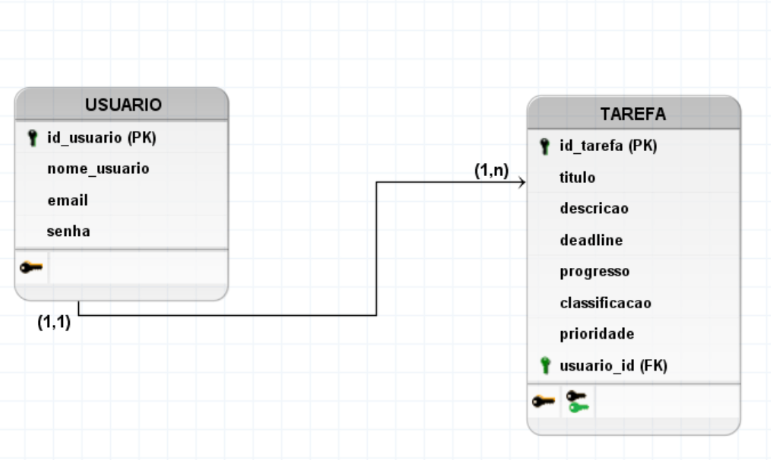

# 1. INTRODUÇÃO
&nbsp; &nbsp; &nbsp; &nbsp;A gestão de tarefas é um processo fundamental para uma maior produtividade, seja em uma empresa ou até mesmo para atividades individuais e do dia a dia (PONTOTEL, 2024). Desse modo, foi criado o vigente projeto de gerenciamento de tarefas, que tem como premissa ser simples e objetivo. Em linhas gerais, ele tem como foco permitir que usuários cadastrados criem, visualizem, editem e excluam tarefas pessoais, organizando-as por prioridade, progresso e prazo (deadline). Em se tratando de aspectos mais técnicos, tal sistema tem sido desenvolvido seguindo o padrão MVC (Model-View-Controller), que facilita a distribuição de funções do software supracitado.

# 2. DIAGRAMAS DO BANCO DE DADOS
&nbsp; &nbsp; &nbsp; &nbsp;De modo geral, a modelagem de dados é o processo de definição e estruturação de como dados serão armazenados (Neves, 2024). Tal procedimento acarreta uma melhor organização do projeto em questão, minimizando erros. Sob essa perspectiva, há, tradicionalmente, há três etapas fundamentais e mais utilizadas para essa modelagem: conceitual, lógica e física. Dessa forma, elas estão descritas, respectivamente, nas seções 2.1, 2.2 e 2.3 (no escopo no vigente projeto de gerenciamento de tarefas).

## 2.1 Modelo conceitual
&nbsp; &nbsp; &nbsp; &nbsp;Essencialmente, o modelo conceitual identifica aspectos fundamentais e basilares de um sistema, mostrando entidades principais e seus respectivos relacionamentos (França, 2023). Dentre as principais ferramentas para a criação do modelo supracitado, menciona-se o Diagrama Entidade-Relacionamento, que demonstra justamente as entidades com suas relações e atributos (características). Portanto, realizou-se esse processo no que se refere ao projeto de gerenciamento de tarefas escopo deste documento (conforme a figura 1).

<p align = "center"> Figura 1 - Diagrama Entidade-Relacionamento </p>


<p align = "center"> Fonte: material produzido pela autora (2025).</p> 
<br>

&nbsp; &nbsp; &nbsp; &nbsp;A partir da figura 1, é possível extrair os seguintes dados, que serão cruciais também para a realização do modelo lógico e do modelo físico:

<h3>ENTIDADE: USUARIO</h3>
<h4>Atributos:</h4>

- id_usuario: identificador do usuário;
- nome_usuario: nome do usuário;
- email: email do usuário;
- senha: senha de acesso do usuário. 

<br>

<h3>ENTIDADE: TAREFA</h3>
<h4>Atributos:</h4>

- id_tarefa: identificador da tarefa;
- título: título ou nome da tarefa;
- descricao: descrição detalhada da tarefa;
- deadline: prazo de conclusão da tarefa;
- progresso: status de progresso da tarefa (ex.: 50%, concluído);
- classificacao: rótulo da tarefa (ex.: UX);
- prioridade: nível de prioridade da tarefa (ex.: alta, média e baixa). 


<br>

<h3>RELACIONAMENTOS</h3>
<h4> USUARIO-TAREFA </h4>

- Cardinalidade: (1,n), que é um-para-muitos;
- Descrição do relacionamento: um usuário pode ter uma ou muitas tarefas.


<h4> TAREFA-USUARIO </h4>

- Cardinalidade: (1,1), que é um-para-um;
- Descrição do relacionamento: uma tarefa se refere a um único usuário.


## 2.2 Modelo lógico/relacional

&nbsp; &nbsp; &nbsp; &nbsp;O modelo lógico consiste na conversão do modelo conceitual em um processo mais próximo do que é, de fato, a implementação de um SGBD (Sistema de Gerenciamento de Banco de Dados). Ademais, seu foco está na definição de tabelas, atributos, tipos de dados, relações, chaves primárias e chaves estrangeiras, aprofundando o que foi feito no conceitual (França, 2023). Dessa forma, foi feito (no software brModelo) o diagrama do modelo lógico no que tange ao vigente projeto, como a figura 2 demonstra. PK indica que um atributo é chave primária e FK indica que um atributo é chave estrangeira. Essa notação foi colocada apenas para facilitar a visualização e no modelo físico elas foram retiradas (ex.: id_usuario (PK) ficou como id_usuario no modelo físico).

<p align = "center"> Figura 2 - Diagrama do modelo lógico</p>



<p align = "center"> Fonte: material produzido pela autora (2025).</p>

<h3>TABELA: USUARIO</h3>
<h4>Atributos (um pouco mais detalhados que no modelo conceitual):</h4>

- id_usuario (PK) - chave primária: identificador único e autoincrementável do usuário;
- nome_usuario: nome do usuário;
- email: email do usuário;
- senha: senha de acesso.

<h3>TABELA: TAREFA</h3>
<h4>Atributos (um pouco mais detalhados que no modelo conceitual):</h4>

- id_tarefa (PK) - chave primária: identificador único e autoincrementável da tarefa;
- titulo: título ou nome da tarefa;
- descricao: descrição detalhada da tarefa;
- deadline: prazo de conclusão da tarefa;
- progresso: status de progresso da tarefa (ex.: 50%, concluído);
- classificacao: rótulo da tarefa (ex.: UX);
- prioridade: nível de prioridade da tarefa (ex.: alta, média e baixa);
- usuario_id (FK): chave estrangeira que referencia USUARIO(id_usuario).


<h3>RELACIONAMENTOS</h3>
&nbsp; &nbsp; &nbsp; &nbsp;Os relacionamentos já foram descritos na seção 2.1. No entanto, achou-se melhor colocá-los aqui novamente para uma melhor leitura.

<h4> USUARIO-TAREFA </h4>

- Cardinalidade: (1,n), que é um-para-muitos;
- Descrição do relacionamento: um usuário pode ter uma ou muitas tarefas.


<h4> TAREFA-USUARIO </h4>

- Cardinalidade: (1,1), que é um-para-um;
- Descrição do relacionamento: uma tarefa se refere a um único usuário.
## 2.3 Modelo físico

&nbsp; &nbsp; &nbsp; &nbsp;Por fim, o modelo físico diz respeito à implementação concreta do banco de dados, com comandos SQL em um SGBD determinado (França, 2023). Desse modo, efetuou-se (usando o Visual Studio Code) o modelo físico referente ao vigente projeto, como é possível ver logo abaixo. Ele será implementado efetivamente nas próximas etapas do projeto individual com o uso do Supabase, plataforma de backend como serviço (BaaS - Backend as a Service) de código aberto baseada em tecnologias PostgreSQL (Oliveira, 2024).	

```sql
CREATE TABLE USUARIO(
  id_usuario SERIAL PRIMARY KEY,
  nome_usuario TEXT NOT NULL,
  email TEXT NOT NULL,
  senha TEXT NOT NULL
);

CREATE TABLE TAREFA (
  id_tarefa SERIAL PRIMARY KEY,
  titulo TEXT NOT NULL,
  descricao TEXT NOT NULL,
  deadline DATE NOT NULL,
  progresso TEXT NOT NULL,
  prioridade TEXT NOT NULL,
  usuario_id INT REFERENCES usuario(id_usuario) ON DELETE CASCADE
);
```

<h3>Descrição um pouco mais aprofundada do modelo físico</h3>

&nbsp; &nbsp; &nbsp; &nbsp;A fim de gerar mais completude ao entendimento do modelo físico, é significativo ressaltar os seguintes aspectos:
- PRIMARY KEY: indica a criação de uma chave primária (identificador);
- NOT NULL: tal especificação impede que um campo seja nulo;
- SERIAL (usado para criação de campos com incremento automático), TEXT (texto), INT (números inteiros) e DATE (data) são os tipos de dados usados nos campos;
- usuario_id INT REFERENCES usuario(id_usuario) ON DELETE CASCADE: tal código define uma chave estrangeira usuario_id, a qual referencia id_usuario (chave primária da tabela USUARIO) e exclui automaticamente os registros relacionados quando o usuário é deletado.

<br>

# REFERÊNCIAS BIBLIOGRÁFICAS

FRANÇA, Thaís. Modelagem de banco de dados relacional: modelagem lógica. [S. l.], 23 nov. 2023. Disponível em: https://medium.com/@francethais/modelagem-de-banco-de-dados-relacional-modelagem-l%C3%B3gica-e-f%C3%ADsica-32c651f6810b. Acesso em: 4 maio 2025.

NEVES, Cristiane Selem Ferreira. Banco de Dados Descomplicado: Modelagem de Dados. [S. l.], 28 ago. 2024. Disponível em: https://www.estrategiaconcursos.com.br/blog/banco-dados-descomplicado-modelagem-dados/. Acesso em: 4 maio 2025.

OLIVEIRA, Miguel. O que é Supabase? O Guia Definitivo para Esta Alternativa ao Firebase. [S. l.], 29 nov. 2024. Disponível em: https://apidog.com/pt/blog/what-is-supabase/. Acesso em: 4 maio 2025.

PONTOTEL. Gestão de tarefas: entenda como esse processo pode ser vantajoso para sua empresa e colaboradores!. [S. l.], 22 nov. 2024. Disponível em: https://www.pontotel.com.br/gestao-de-tarefas/. Acesso em: 4 maio 2025.