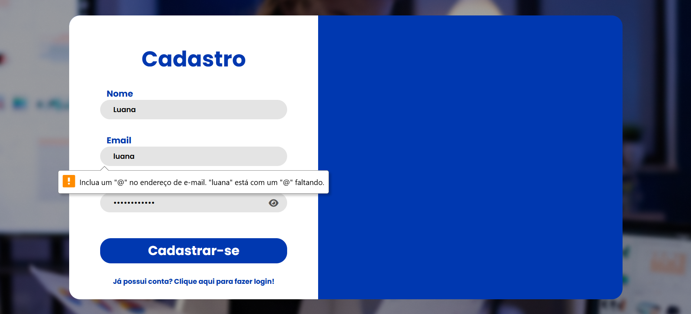
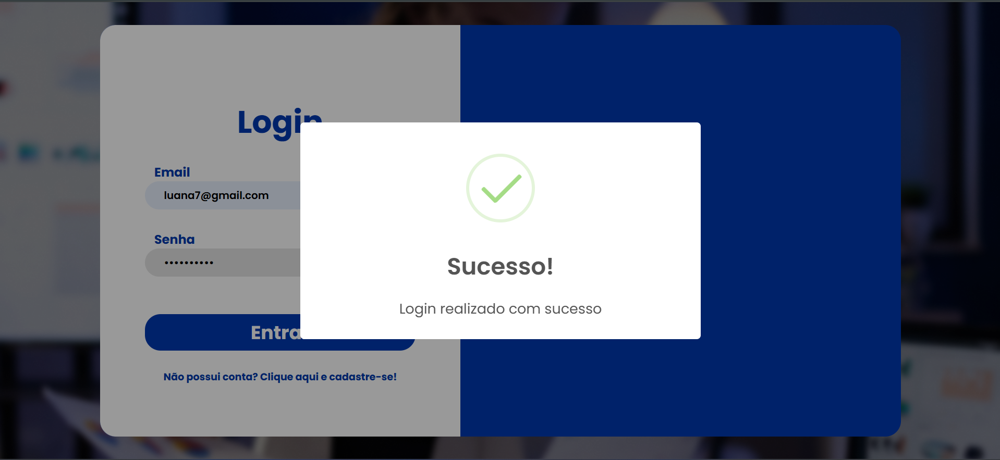
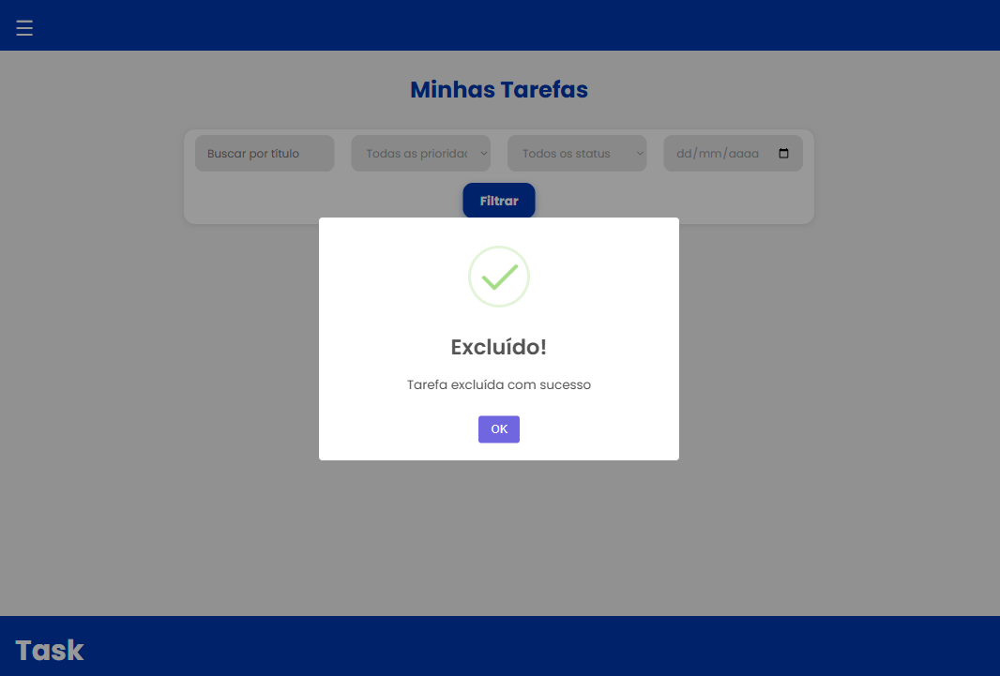
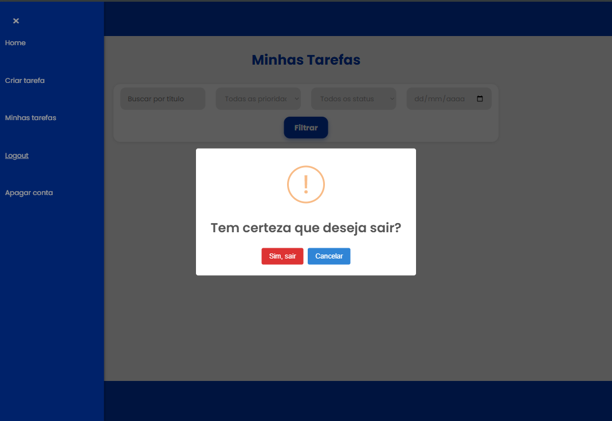

# Task: descrição do projeto 
&nbsp; &nbsp; &nbsp; &nbsp;Em linhas gerais, o site Task consiste em um gerenciador de tarefas, no qual os usuários terão opções de cadastro e login, ou seja, poderão criar contas próprias, a fim de registrar suas atividades. Estas poderão ser editadas, filtradas, alteradas, adicionadas e excluídas, tendo informações de id, título, descrição, deadline, progresso, classificação (rótulo da tarefa) e prioridade.A partir de tais aspectos, objetiva-se que os utilizadores do sistema possam deter um maior controle sobre suas tasks e, consequentemente, um melhor planejamento.

# Estrutura de pastas
&nbsp; &nbsp; &nbsp; &nbsp;Logo abaixo está descrita a estrutura de pastas do projeto.
```
gerenciadorDeTarefas-ProjetoIndividual/
│
├── assets/                     # Arquivos públicos como imagens e fontes
|       
├── config/                     # Arquivos de configuração (ex: conexão com banco)
│   └── database.js
|
├── controllers/                # Lógica de controle das requisições
│   └── tarefaController.js     # Controller da tarefa
|   └── usuarioController.js    # Controller do usuário
|   
├── documents/                  # Documentação do projeto (WAD)
|   └── WAD.md
|
├── models/                     # Definição de modelos de dados (estrutura do banco)
│   └── tarefa.js               # Model da tarefa
|   └── usuario.js              # Model do usuário
|
├── node_modules/               # Pacotes do node (tem muitas pastas dentro dele)
|
├── routes/                 # Definição das rotas do sistema (rotas de usuário e tarefa)
│   └── index.js
|
├── scripts                     # Arquivos de JavaScript públicos
│   └── abrirMenuHamburguer.js
│   └── animacoes.js
│   └── cadastro.js
│   └── criarTarefa.js
│   └── excluirConta.js
│   └── graficos.js
│   └── init.sql
│   └── listarTarefas.js
│   └── login.js
│   └── logout.js
│   └── runSQLScript.js
|
├── services/                   # Serviços auxiliares do sistema
│   └── userService.js             
|               
├── styles/                     # Arquivos CSS públicos
│   └── criarTarefa.css
│   └── footer.css
│   └── header.css
│   └── home.css
│   └── landingPage.css
│   └── listarTarefas.css
│   └── loginAndSignUp.css
│   └── style.css.css
|
├── tests/                      # Arquivos de testes unitários
│   └── example.test.js
|
├── views/                      # Templates e componentes visuais da aplicação
|   └── Cadastro/
|       └── index.ejs
|   └── components/
|       └── footer.ejs
|       └── header.ejs
|   └── CriarTarefa/
|       └── index.ejs
|   └── Home/
|       └── index.ejs
|   └── LandingPage/
|       └── index.ejs
|   └── Login/
|       └── index.ejs
|   └── MinhasTarefas/
|       └── index.ejs
|
├── .gitignore                  # Arquivo para ignorar arquivos no Git
|
├── .env                        # Arquivo para variáveis de ambiente (banco de dados)
|
├── jest.config.js              # Arquivo de configuração do Jest
|
├── package-lock.json           # Gerenciador de dependências do Node.js
|
├── package.json                # Gerenciador de dependências do Node.js
|
├── README.md                   # Descrição do projeto e de como instalá-lo
|
├── server.js                   # Arquivo principal que inicializa o servidor
|
└── rest.http                   # Teste de endpoints (opcional)
```
# Prints da interface
&nbsp; &nbsp; &nbsp; &nbsp;No projeto foram desenvolvidas 6 views: Landing page, login, cadastro, home, minhas tarefas e criar tarefa. Ademais, o footer e o header da aplicação foram separados na pasta components, uma vez que estão padronizados para as views. É importante ressaltar que a descrição das views nesta seção também está presente no WAD.

&nbsp; &nbsp; &nbsp; &nbsp;A figura 1 mostra a view de landing page, que possui os botões de login, cadastro e inscreva-se grátis (que direciona para o cadastro também).
<p align = "center"> Figura 1 - View de Landing Page</p>
<div align = "center">

</div>
<p align = "center"> Fonte: material produzido pela autora (2025).</p>
<br>

&nbsp; &nbsp; &nbsp; &nbsp;A figura 2 mostra a view de cadastro quando o usuário a acessa. A figura 3 mostra a verificação se o e-mail possui @ em sua estrutura (com base na estrutura padrão de e-mail, já que o input é do tipo e-mail). A figura 4 mostra o popup que aparece quando o usuário tenta cadastrar uma senha sem 8 caracteres, 1 letra maiúscula e um caractere especial. ,A figura 5 mostra o popup que aparece ao usuário quando ele tenta cadastrar um e-mail que já está cadastrado. Vale mencionar que quando o usuário faz o cadastro com sucesso, ele é direcionado à view de login para entrar no site. 
<p align = "center"> Figura 2 - View de cadastro</p>
<div align = "center">

</div>
<p align = "center"> Fonte: material produzido pela autora (2025).</p>
<br>

<p align = "center"> Figura 3 - View de cadastro - testar email sem @</p>
<div align = "center">

</div>
<p align = "center"> Fonte: material produzido pela autora (2025).</p>
<br>

<p align = "center"> Figura 4 - View de cadastro - testar senha sem 8 caracteres, 1 letra maiúscula e um caractere especial </p>
<div align = "center">

</div>
<p align = "center"> Fonte: material produzido pela autora (2025).</p>
<br>

<p align = "center"> Figura 5 - View de cadastro - testar cadastro com um email já cadastrado </p>
<div align = "center">

</div>
<p align = "center"> Fonte: material produzido pela autora (2025).</p>
<br> <br>

&nbsp; &nbsp; &nbsp; &nbsp;A figura 6 mostra a view de login quando o usuário a acessa. Já a figura 7 mostra o popup que é apresentado ao usuário quando ele erra seu e-mail ou sua senha. Já a figura 8 mostra o popup que aparece ao usuário quando ele faz o login com sucesso. Logo abaixo das imagens, é mostrado  como fetch API foi usado na tela de login.

<p align = "center"> Figura 6 - View de login</p>
<div align = "center">

</div>
<p align = "center"> Fonte: material produzido pela autora (2025).</p>
<br>


<p align = "center"> Figura 7 - View de login - e-mail ou senha incorretos</p>
<div align = "center">

</div>
<p align = "center"> Fonte: material produzido pela autora (2025).</p>
<br>

<p align = "center"> Figura 8 - View de login - sucesso no login</p>
<div align = "center">

</div>
<p align = "center"> Fonte: material produzido pela autora (2025).</p>
<br>

```javascript
// ***USO DE FETCH API NO LOGIN -> arquivo scripts/login.js***
try {
      //Feth API
      const response = await fetch('/login', {
            method: 'POST',
            headers: { 'Content-Type': 'application/json' },
            body: JSON.stringify({ email, senha })
        });

      const data = await response.json();

      if (response.ok) {
            // Login OK
            Swal.fire({
                icon: 'success',
                title: 'Sucesso!',
                text: data.mensagem,
                timer: 2000,
                showConfirmButton: false,
                scrollbarPadding: false
            }).then(() => {
                //Redirecionar para home depois do alerta fechar.
                window.location.href = '/home';
            });

        }else {
            //Erro no login (ex: senha incorreta).
            Swal.fire({
                icon: 'error',
                title: 'Erro',
                text: data.error || 'Erro ao realizar login'
            });
        }
}catch (error) {
            Swal.fire({
            icon: 'error',
            title: 'Erro',
            text: 'Erro na comunicação com o servidor'
        });
            console.error(error);
}
```
 <br> <br>

&nbsp; &nbsp; &nbsp; &nbsp;As figuras 9 e 10 mostram a tela de home, que é aberta após o login do usuário. Nela, são mostradas quantas tarefas o usuário têm no total, quantas estão concluídas e quantas estão pendentes, por meio de um m. Além disso, especificamente a figura 10 apresenta a seção de gráficos que é apresentada ao usuário.
<p align = "center"> Figura 9 - View de home - parte 1</p>
<div align = "center">

</div>
<p align = "center"> Fonte: material produzido pela autora (2025).</p>
<br>

<p align = "center"> Figura 10 - View de home - parte 2</p>
<div align = "center">

</div>
<p align = "center"> Fonte: material produzido pela autora (2025).</p>
<br>

```javascript
    //Este código, que está em controllers/usuarioController.js, manda os dados para a view de home com uma identificação específica.
    res.render('Home/index', {
      nomeUsuario: usuario.nome_usuario,
      totalTarefas: total,
      tarefasConcluidas: concluidas,
      tarefasAFazer: aFazer
    });
```
<br> 

```
//E essa identificação é aplicada em views/Home/index.ejs dessa maneira:
<h2 class="home__body__dashboard__cartao__numero"><%= tarefasConcluidas %></h2>
<h2 class="home__body__dashboard__cartao__numero"><%= totalTarefas %></h2> 
<h2 class="home__body__dashboard__cartao__numero"><%= totalTarefas %></h2>               
```
<br> <br>
&nbsp; &nbsp; &nbsp; &nbsp;A figura 11 mostra a sidebar que é aberta quando o usuário clica no menu hambúrguer no canto superior esquerdo da tela, com todas as opções de funcionalidades da aplicação web (ir para home, minhas tarefas, criar tarefa, logout e excluir conta). Essa sidebar é padrão para todas as páginas do site. Por fim, o uso de fetch API nessa parte está explicitado logo abaixo das figuras.
<p align = "center"> Figura 11 - Abrindo a sidebar</p>
<div align = "center">

</div>
<p align = "center"> Fonte: material produzido pela autora (2025).</p>
<br>

```javascript
//***USANDO FETCH API NA SIDEBAR***
//1) Fetch API para logout --> ARQUIVO scripts/logout.js
document.getElementById('btn-logout').addEventListener('click', function(event) {
  event.preventDefault();

  Swal.fire({
    title: 'Tem certeza que deseja sair?',
    icon: 'warning',
    showCancelButton: true,
    confirmButtonColor: '#d33',
    cancelButtonColor: '#3085d6',
    confirmButtonText: 'Sim, sair',
    cancelButtonText: 'Cancelar'
  }).then(async (result) => {
    if (result.isConfirmed) {
      try {
        //Fazendo o logout via GET.
        const response = await fetch('/logout', { method: 'GET' });
        
        if (response.ok) {
          //Mostrando a mensagem de sucesso do logout.
          Swal.fire({
            icon: 'success',
            title: 'Logout efetuado com sucesso!',
            showConfirmButton: false,
            timer: 1500,
          }).then(() => {
            //Redirecionando para a landing page após o logout.
            window.location.href = '/';
          });
        } else {
          Swal.fire('Erro', 'Não foi possível sair. Tente novamente.', 'error');
        }
      } catch (error) {
        Swal.fire('Erro', 'Erro ao se comunicar com o servidor.', 'error');
      }
    }
  });
});
```

```javascript
//2)Fetch API para exclusão de conta do usuário --> ARQUIVO scripts/excluirConta.js
document.getElementById("btn-excluir-conta").addEventListener("click", async () => {
  const { isConfirmed } = await Swal.fire({
    title: 'Tem certeza?',
    text: "Deseja apagar sua conta? Essa ação não pode ser desfeita.",
    icon: 'warning',
    showCancelButton: true,
    confirmButtonColor: '#d33',
    cancelButtonColor: '#3085d6',
    confirmButtonText: 'Sim, apagar minha conta',
    cancelButtonText: 'Cancelar'
  });

  if (!isConfirmed) return;

  //Usando fetch API para excluir conta.
  try {
    const res = await fetch("/excluirConta", {
      method: "DELETE",
      headers: { "Content-Type": "application/json" }
    });

    const data = await res.json();

    if (res.ok) {
      await Swal.fire({
        icon: 'success',
        title: 'Conta apagada',
        text: data.mensagem,
        timer: 2500,
        timerProgressBar: true,
        showConfirmButton: false,
      });
      window.location.href = "/"; 
    } else {
      Swal.fire({
        icon: 'error',
        title: 'Erro',
        text: data.error || 'Erro ao apagar conta.',
      });
    }
  } catch (error) {
    Swal.fire({
      icon: 'error',
      title: 'Erro',
      text: 'Erro na comunicação com o servidor.',
    });
  }
});
```
<br><br>

&nbsp; &nbsp; &nbsp; &nbsp;As figuras 12, 13 e 14 mostram a view de criar tarefas. A figura 45 mostra o popup que aparece quando o usuário tenta criar uma tarefa vazia (aparece um erro). Já a figura 46 mostra o popup que é apresentado ao usuário quando ele cria uma tarefa com sucesso. Por fim, o uso de fetch API nessa parte está explicitado logo abaixo das figuras.

<p align = "center"> Figura 12 - View de criar tarefa</p>
<div align = "center">

</div>
<p align = "center"> Fonte: material produzido pela autora (2025).</p>
<br>

<p align = "center"> Figura 13 - View de criar tarefa - testando enviar tarefa vazia</p>
<div align = "center">

</div>
<p align = "center"> Fonte: material produzido pela autora (2025).</p>
<br>

<p align = "center"> Figura 14 - View de criar tarefa - criando tarefa com sucesso</p>
<div align = "center">

</div>
<p align = "center"> Fonte: material produzido pela autora (2025).</p>
<br> <br>

```javascript
//***Trecho do ARQUIVO scripts/criarConta.js***

//Usando fetch API para mandar os dados das tarefas criadas ao banco por meio da rota /tarefas.
    try {
      const resposta = await fetch('/tarefas', {
        method: 'POST',
        headers: { 'Content-Type': 'application/json' },
        body: JSON.stringify(dados)
      });

      //Retornando ao usuário se a tarefa foi criada com sucesso ou não.
      if (resposta.ok) {
        Swal.fire({
          icon: 'success',
          title: 'Tarefa criada!',
          text: 'Sua tarefa foi registrada com sucesso.',
          confirmButtonColor: '#0038B0'
        });
        e.target.reset();
      } else {
        const erro = await resposta.text();
        Swal.fire({
          icon: 'error',
          title: 'Erro ao criar tarefa',
          text: erro,
          confirmButtonColor: '#c0392b'
        });
      }
    } catch (err) {
      Swal.fire({
        icon: 'error',
        title: 'Erro no servidor',
        text: 'Tente novamente mais tarde.',
        confirmButtonColor: '#c0392b'
      });
    }
```

<br><br>


&nbsp; &nbsp; &nbsp; &nbsp;Das figuras 15 a 19 é mostrada a view de minhas tarefas. Na parte superior da página, há uma área de filtros que permite ao usuário buscar tarefas com base em critérios como título, prioridade, status e data. Abaixo dessa parte de filtros ficam os cards, que resumem uma tarefa específica, contendo informações como título, descrição, status, prioridade e prazo. Além disso, esses cartões também oferecem botões de ação para editar ou excluir a tarefa. Especificamente, a figura 48 mostra o processo de edição de tarefas (por meio de um popup) e a figura 18 apresenta um popup que pergunta ao usuário se ele, de fato, quer excluir uma tarefa. Já as figuras 17 e 19 mostram os popups que são mostrados quando uma tarefa é editada com sucesso e quando uma tarefa é excluída com sucesso, respectivamente. Logo abaixo das figuras, está explicitado como fetch API foi usado.

<p align = "center"> Figura 15 - View de minhas tarefas</p>
<div align = "center">

</div>
<p align = "center"> Fonte: material produzido pela autora (2025).</p>
<br>


<p align = "center"> Figura 16 - View de minhas tarefas - Abrindo o popup para editar tarefas</p>
<div align = "center">

</div>
<p align = "center"> Fonte: material produzido pela autora (2025).</p>
<br>

<p align = "center"> Figura 17 - View de minhas tarefas - Atualizando tarefa com sucesso</p>
<div align = "center">

</div>
<p align = "center"> Fonte: material produzido pela autora (2025).</p>
<br>

<p align = "center"> Figura 18 - View de minhas tarefas - Popup de confirmação para excluir tarefas</p>
<div align = "center">

</div>
<p align = "center"> Fonte: material produzido pela autora (2025).</p>
<br>

<p align = "center"> Figura 19 - View de minhas tarefas - tarefa excluída com sucesso</p>
<div align = "center">

</div>
<p align = "center"> Fonte: material produzido pela autora (2025).</p>
<br> <br>


```javascript
//*** ARQUIVO scripts/listarTarefas.js***

//Função para criar o card da tarefa dinamicamente.
function criarCardTarefa(tarefa) {
  const statusFormatado = tarefa.progresso.charAt(0).toLowerCase() + tarefa.progresso.slice(1);
  return `
    <div class="card-tarefa" data-id="${tarefa.id_tarefa}">
      <h2>${tarefa.titulo}</h2>
      <p>${tarefa.descricao}</p>
      <p><strong>Status:</strong> ${statusFormatado}</p>
      <p><strong>Prioridade:</strong> ${tarefa.prioridade}</p>
      <p><strong>Deadline:</strong> ${tarefa.data_formatada || tarefa.deadline}</p>
      <div class="acoes">
        <button class="btn-editar" data-id="${tarefa.id_tarefa}">Editar</button>
        <button class="btn-excluir" data-id="${tarefa.id_tarefa}">Excluir</button>
      </div>
    </div>
  `;
}

//Função para aplicar eventos às tarefas.
function aplicarEventos(tarefas) {
  const lista = document.getElementById('listaTarefas');
  if (!tarefas.length) {
    lista.innerHTML = '<p>Nenhuma tarefa encontrada.</p>';
    return;
  }

  lista.innerHTML = tarefas.map(criarCardTarefa).join('');

  //Botão excuir tarefas.
  document.querySelectorAll('.btn-excluir').forEach(btn => {
    btn.addEventListener('click', async () => {
      const id = btn.getAttribute('data-id');
      Swal.fire({
        title: 'Tem certeza?',
        text: 'Você não poderá reverter esta ação!',
        icon: 'warning',
        showCancelButton: true,
        confirmButtonColor: '#d33',
        cancelButtonColor: '#3085d6',
        confirmButtonText: 'Sim, excluir!',
        cancelButtonText: 'Cancelar'
      }).then(async (result) => {
        if (result.isConfirmed) {
          //Usando fetch API para excluir tarefas.
          try {
            const res = await fetch(`/tarefas/${id}`, { method: 'DELETE' });
            const json = await res.json();

            if (res.ok) {
              btn.closest('.card-tarefa').remove();
              Swal.fire('Excluído!', json.mensagem || 'A tarefa foi removida.', 'success');
            } else {
              Swal.fire('Erro!', json.erro || 'Erro ao excluir tarefa.', 'error');
            }
          } catch (err) {
            console.error(err);
            Swal.fire('Erro!', 'Erro ao excluir tarefa.', 'error');
          }
        }
      });
    });
  });


  //Botão editar tarefas.
  document.querySelectorAll('.btn-editar').forEach(btn => {
    btn.addEventListener('click', async () => {
      const id = btn.getAttribute('data-id');
      try {
        const res = await fetch(`/tarefas/${id}`);
        const tarefa = await res.json();

        document.getElementById('editar-id').value = tarefa.id_tarefa;
        document.getElementById('editar-titulo').value = tarefa.titulo;
        document.getElementById('editar-descricao').value = tarefa.descricao;
        document.getElementById('editar-progresso').value = tarefa.progresso;
        document.getElementById('editar-prioridade').value = tarefa.prioridade;
        document.getElementById('editar-deadline').value = tarefa.deadline.slice(0, 10);

        document.getElementById('modal-editar').classList.remove('hidden');
      } catch (err) {
        console.error(err);
        alert('Erro ao carregar tarefa para edição');
      }
    });
  });
}

//Carregando as tarefas na view de mostrar tarefas.
function carregarTarefas() {
  //Usando fetch API para carregar as tarefas.
  fetch('/tarefas')
    .then(res => {
      if (!res.ok) throw new Error('Erro ao carregar tarefas');
      return res.json();
    })
    .then(tarefas => {
      window.todasTarefas = tarefas;
      aplicarEventos(tarefas);
    })
    .catch(error => {
      console.error(error);
      document.getElementById('listaTarefas').innerHTML = '<p>Erro ao carregar tarefas.</p>';
    });
}

//Função para aplicar filtros de busca às tarefas.
function aplicarFiltros() {
    const titulo = document.getElementById('filtro-titulo').value.toLowerCase();
    const prioridade = document.getElementById('filtro-prioridade').value;
    const status = document.getElementById('filtro-status').value;
    const deadline = document.getElementById('filtro-deadline').value;

   
    const filtradas = window.todasTarefas.filter(tarefa => {

     //Formatando as datas das tarefas já cadastradas para o padrão usado no Brasil
    const dataTarefa = new Date(tarefa.deadline);
    const dataFormatada = new Intl.DateTimeFormat("pt-br").format(dataTarefa);

    //Transformando a deadline colocada no filtro de busca para o padrão do Brasil.
    let deadlineFormatada;
    if(deadline){
      const [ano,mes,dia] = deadline.split("-");
      deadlineFormatada = `${dia}/${mes}/${ano}`
      console.log(deadlineFormatada);
    }

    const tituloMatch = tarefa.titulo.toLowerCase().includes(titulo);
    const prioridadeMatch = !prioridade || tarefa.prioridade.toLowerCase() === prioridade.toLowerCase();
    const statusMatch = !status || tarefa.progresso.toLowerCase() === status.toLowerCase();
    const deadlineMatch = !deadline || dataFormatada == deadlineFormatada;
    console.log(tarefa.deadline);
    console.log(deadlineMatch);
    return tituloMatch && prioridadeMatch && statusMatch && deadlineMatch;
    
  });

  aplicarEventos(filtradas);
}

document.getElementById('btn-aplicar-filtros').addEventListener('click', aplicarFiltros);

document.getElementById('fechar-modal').addEventListener('click', () => {
  document.getElementById('modal-editar').classList.add('hidden');
});


document.getElementById('btn-salvar-edicao').addEventListener('click', async (event) => {
  event.preventDefault(); 

  const id = document.getElementById('editar-id').value;
  const titulo = document.getElementById('editar-titulo').value;
  const descricao = document.getElementById('editar-descricao').value;
  const progresso = document.getElementById('editar-progresso').value;
  const prioridade = document.getElementById('editar-prioridade').value;
  const deadline = document.getElementById('editar-deadline').value;

  //Usando fetch API para atualizar tarefas.
  try {
    const res = await fetch(`/tarefas/${id}`, {
      method: 'PUT',
      headers: {
        'Content-Type': 'application/json',
      },
      body: JSON.stringify({ titulo, descricao, progresso, prioridade, deadline })
    });

    const json = await res.json();

    if (res.ok) {
      Swal.fire('Sucesso!', json.mensagem || 'Tarefa atualizada com sucesso!', 'success');
      document.getElementById('modal-editar').classList.add('hidden');
      carregarTarefas();
    } else {
      Swal.fire('Erro!', json.erro || 'Não foi possível atualizar a tarefa.', 'error');
    }
  } catch (err) {
    console.error(err);
    Swal.fire('Erro!', 'Erro ao atualizar tarefa.', 'error');
  }
});


carregarTarefas();

```
<br> <br>

&nbsp; &nbsp; &nbsp; &nbsp;As figuras 20 e 21 mostram o processo de logout do usuário. Primeiro, aparece um popup perguntando se o usuário quer, de fato, se deslogar. Caso ele confirme, aparece um popup de sucesso no logout. Detalhe: após o logout, o usuário é direcionado à landing page. O uso de fetch API para tal funcionalidade já foi demonstrado na seção do header/sidebar.
<p align = "center"> Figura 20 - Popup que aparece quando "logout" (que está na sidebar) é clicado.</p>
<div align = "center">

</div>
<p align = "center"> Fonte: material produzido pela autora (2025).</p>
<br>

<p align = "center"> Figura 21 - Logout realizado com sucesso</p>
<div align = "center">

</div>
<p align = "center"> Fonte: material produzido pela autora (2025).</p>
<br><br>


&nbsp; &nbsp; &nbsp; &nbsp;As figuras 22 e 23 mostram o processo de exclusão de conta do usuário. Primeiro, aparece um popup perguntando se o usuário quer, de fato, excluir a conta. Caso ele confirme, aparece um popup de sucesso na exclusão. Após excluir sua conta, o usuário é direcionado à landing page. O uso de fetch API para tal funcionalidade já foi demonstrado na seção do header/sidebar.
<p align = "center"> Figura 22 - Popup que aparece quando "Apagar conta" (que está na sidebar) é clicado</p>
<div align = "center">

</div>
<p align = "center"> Fonte: material produzido pela autora (2025).</p>
<br>

<p align = "center"> Figura 23 - Popup de conta excluída com sucesso</p>
<div align = "center">

</div>
<p align = "center"> Fonte: material produzido pela autora (2025).</p>
<br>

# Como executar o projeto localmente?
&nbsp; &nbsp; &nbsp; &nbsp;Para criar estes passos, usou-se como referência o seguinte link: https://github.com/afonsobrandaointeli/mvc-boilerplate , o qual foi disponibilizado na explicação da atividade.

&nbsp; &nbsp; &nbsp; &nbsp;Primeiramente, certifique-se de atender aos seguintes pré-requisitos:
Node.js (v18+)
PostgreSQL (v15+)
Git

&nbsp; &nbsp; &nbsp; &nbsp;Após tal averiguação, siga os passos subsequentes:

## Parte 1: instalação

1) Clone o projeto
```
git clone https://github.com/luanalima77/gerenciadorDeTarefas-ProjetoIndividual.git
```
<br>

2) Instale as dependências

&nbsp; &nbsp; &nbsp; &nbsp;**Instale todas as dependências, se não o projeto pode não rodar conforme o esperado.** <br>

&nbsp; &nbsp; &nbsp; &nbsp;Dependências do Node:

```
npm install
```
<br>

&nbsp; &nbsp; &nbsp; &nbsp;Dependências do PostgreSQL:
```
npm install pg
```
<br>

&nbsp; &nbsp; &nbsp; &nbsp;Dependências do .env:
```
npm install dotenv
```
<br>

&nbsp; &nbsp; &nbsp; &nbsp;Dependências do CORS (para permitir requisições entre diferentes origens):
```
npm install cors
```
<br>

&nbsp; &nbsp; &nbsp; &nbsp;Dependências do express-session (para gerenciar sessões de usuário, como em logins):
```
npm install express-session
```
<br>

&nbsp; &nbsp; &nbsp; &nbsp;Dependências do ejs (que são os arquivos das views do projeto):
```
npm install ejs
```
<br>

&nbsp; &nbsp; &nbsp; &nbsp;Dependências do method-override (para permitir métodos PUT e DELETE via formulários HTML):
```
npm install method-override
```
<br>


&nbsp; &nbsp; &nbsp; &nbsp;Dependências do bcrypt, que permite deixar a senha do usuário criptografada no banco de dados:

```
npm install bcrypt
```
<br>

&nbsp; &nbsp; &nbsp; &nbsp;Dependências do date-fns (para manipulação e formatação de datas):
```
npm install date-fns
```

<br><br>

## Parte 2: configuração do banco de dados
1) Faça a configuração das variáveis de ambiente necessárias, a exemplo das configurações do banco de dados PostgreSQL. No caso deste projeto, usou-se o Supabase para armazenar os dados. Dessa forma, para rodar seu projeto com as suas credenciais do Supabase, insira isso no arquivo .env: 

```
DB_USER=
DB_HOST=
DB_DATABASE=
DB_PASSWORD=
DB_PORT=
DB_SSL=
PORT=
```

&nbsp; &nbsp; &nbsp; &nbsp;Detalhe importante: a porta (PORT) que está sendo usada neste projeto é a 3000. As outras configurações podem ser conferidas dentro do próprio site do Supabase. <br>
&nbsp; &nbsp; &nbsp; &nbsp;Para isso, procure pelo botão "Connect" ao entrar no Supabase (figura 24): 

<p align = "center"> Figura 24 - Botão "Connect" (Supabase)</p>
<div align = "center">

</div>
<p align = "center"> Fonte: material retirado do Supabase.</p>
<br> <br>

&nbsp; &nbsp; &nbsp; &nbsp;Depois, procure por "Session pooler" e clique em "View parameters". Lá, vão estar todos os dados necessários para colocar no .env e, assim, conectar o seu banco de dados ao projeto (figura 25):

<p align = "center"> Figura 25 - Session Pooler (Supabase)</p>
<div align = "center">

</div>
<p align = "center"> Fonte: material retirado do Supabase.</p>
<br> <br>


2) Depois, execute o script SQL de inicialização no terminal:
```
npm run init-db
```

3) Depois de seguir esses passos, execute o seguinte comando no terminal:
```
node server.js
```

## Observações
&nbsp; &nbsp; &nbsp; &nbsp; Sempre que você precisar iniciar o servidor, rode o seguinte comando no terminal:

```
node server.js
```
